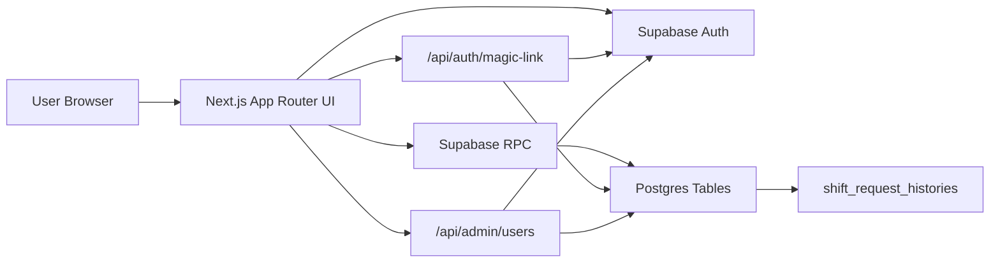
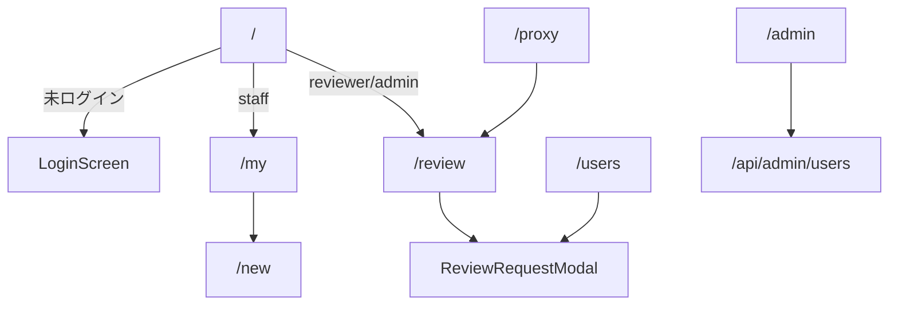
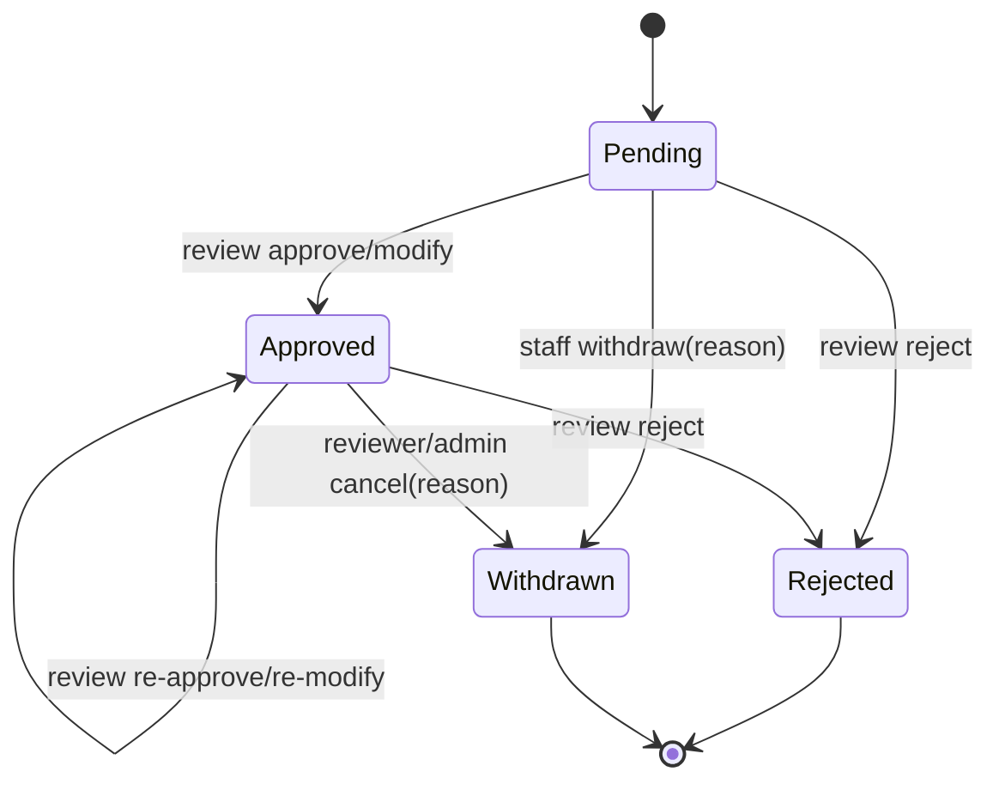
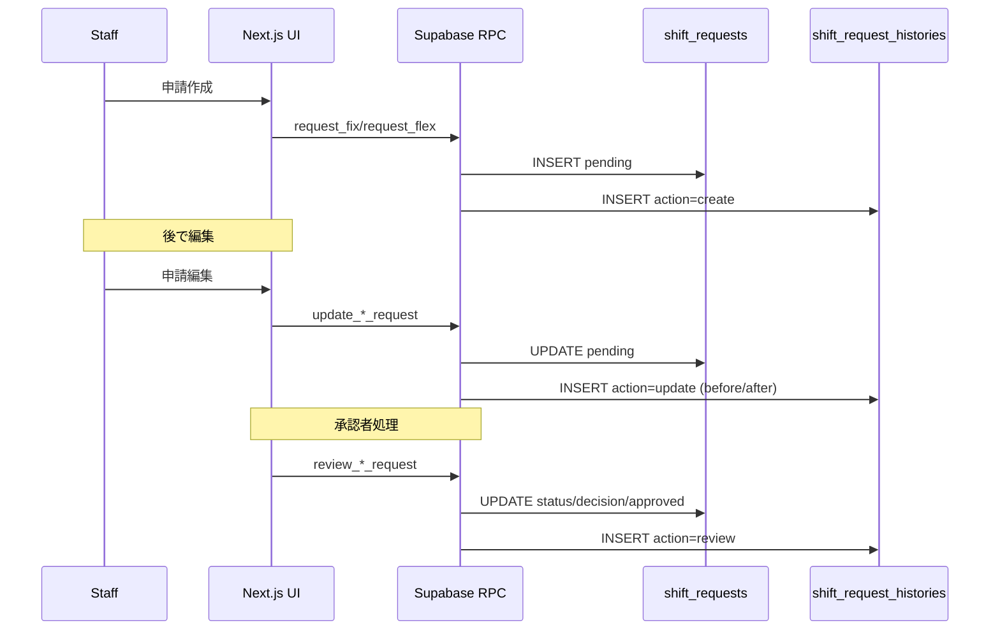

# シフト管理システム Phase 1 実装仕様・整合レビュー（コード一致版）

最終更新日: 2026-02-26  
対象: 開発チーム / 運用チーム / レビュアー

---

## 0. このドキュメントの目的

本ドキュメントは、以下を**1つの資料に統合**した「実装基準書」です。

1. 現在の実装が実際にどう動くか（仕様化）
2. DB / RPC / RLS / UI の相互整合
3. 要件との適合状況（どこまで実装済みか）
4. Context7（公式ドキュメント系）に基づくベストプラクティス評価

> 重要: 本書は「過去の仕様案」ではなく、**現行コードと現行DB定義**に基づく。

---

## 1. システム全体像

### 1.1 アーキテクチャ

### 1.2 実装上の責務分離

- UI/クライアント:
  - 表示、入力補助、軽量バリデーション、UX警告（連絡推奨など）
- DB/RPC:
  - 主要業務ルールの最終判定（権限、重複、過去日、時間上限、状態遷移）
- RLS:
  - SELECTのスコープ制御
  - 直接INSERT/UPDATE/DELETEはポリシー未付与により不可（RPC経由のみ）

---

## 2. 認証・認可

## 2.1 ログイン方式

- マジックリンクのみ
- 実装箇所:
  - `components/login-screen.tsx`
  - `app/api/auth/magic-link/route.ts`

### 2.2 マジックリンクAPIの挙動

`POST /api/auth/magic-link`

- `email` 必須
- `profiles` に対象emailが存在しない場合:
  - `FIRST_ADMIN_EMAIL` と一致かつ `profiles` 件数が0なら初回管理者をブートストラップ
  - それ以外は `404 アカウントが見つかりません`
- `active=false` は拒否
- `signInWithOtp({ shouldCreateUser: false })` を使用（未登録ユーザー自動作成禁止）

### 2.3 ロール

- `staff`
- `reviewer`
- `admin`

### 2.4 画面アクセス制御

- `components/app-shell.tsx` でロールごとにタブ許可を制御
- 不正タブアクセス時はデフォルトタブへリダイレクト

---

## 3. 画面ルーティングと機能範囲

### 3.1 `staff`

- `/my`: 申請一覧、詳細、編集、取り下げ
- `/new`: 新規申請（自分の `request_type` のみ）

### 3.2 `reviewer`

- `/review`: 承認待ち・全件
- `/proxy`: 代理作成（即確定）
- `/users`: スタッフ別詳細

### 3.3 `admin`

- reviewer機能全部
- `/admin`: ユーザー追加/編集/有効無効

---

## 4. データモデル（実装値）

## 4.1 `public.profiles`

主要カラム:

- `id uuid PK (auth.users FK)`
- `email text unique`
- `name text`
- `role text check ('admin','reviewer','staff')`
- `active boolean`
- `request_type text check ('fix','flex')`
- `created_at`, `updated_at`

> 注記: `request_type` は現行実装で活用中（ユーザーごとにFix/Flexを固定）。

## 4.2 `public.shift_requests`

共通:

- `id`, `user_id`, `created_by`, `type`, `status`
- `note`（申請者メッセージ）
- `reviewer_note`（処理メッセージ）
- `reviewed_by`, `reviewed_at`
- `decision_type`, `change_reason`
- `created_at`, `updated_at`

Fix:

- `requested_start_at`, `requested_end_at`
- `approved_start_at`, `approved_end_at`

Flex:

- `iso_year`, `iso_week`, `week_start_date`
- `requested_hours`, `approved_hours`

制約（要点）:

- `requested_hours > 0`
- `approved_hours > 0`（NULL以外）
- Fixの申請時間 `requested_start_at < requested_end_at`
- `type='fix' AND decision_type='modify'` のとき `change_reason` 必須
- decision_type許容値:
  - Fix: `approve | modify | reject`
  - Flex: `approve | modify | partial | reject`

> 注記: Flexの `partial` は互換性維持のため許容。新規UI操作は `modify` に統一。

## 4.3 Flex一意性

- ユニークインデックス:
  - `unique(user_id, iso_year, iso_week)`
  - 適用条件: `type='flex' AND status IN ('pending','approved')`

意味:

- pending/approved の同一週重複は不可
- rejected/withdrawn 後の同一週再申請は可

## 4.4 `public.shift_request_histories`

- 変更履歴の時系列記録
- `action`: `create | proxy_create | update | withdraw | review | reopen`
- `details jsonb` に差分・理由・メッセージを保存

## 4.5 `public.hourly_rates`

- reviewer/admin が staff ごとの時給を管理
- `effective_from date`:
  - `YYYY-MM-DD` を指定した場合は「その日から適用」
  - `NULL` の場合は「初回設定（日時未指定の基準時給）」
- `get_hourly_rate_for_date(user_id, date)` は
  - `effective_from <= date` の中で最新を優先
  - 該当がなければ `effective_from is null` をフォールバック
- 運用メモ:
  - 旧定義（`p_effective_until`）から更新した直後は PostgREST の schema cache が古い場合がある
  - 反映後に RPC が見つからない場合は schema cache を再読み込みする
- UI:
  - `/users` の時給設定は折りたたみ表示
  - 展開時は「時給 / 開始年(手入力) / 開始月(選択式) / 保存」の1行フォームで登録し、開始日は `YYYY-MM-21` に正規化する
  - 同画面の申請一覧は `type/status` フィルタ付きで絞り込み表示できる

---

## 5. 状態遷移モデル

補足:

- Approvedへの再処理（編集再確定）を許可
- Withdrawn/Rejectedは編集不可

---

## 6. RLS設計

## 6.1 `profiles`

- SELECT:
  - 本人（active=true）
  - reviewer/admin は全件
- UPDATE:
  - adminのみ

## 6.2 `shift_requests`

- SELECT:
  - staff: 自分の申請のみ（かつ本人active）
  - reviewer/admin: 全件
- INSERT/UPDATE/DELETE:
  - ポリシーなし = 直接操作不可

## 6.3 `shift_request_histories`

- SELECT:
  - staff: 自分の申請履歴のみ
  - reviewer/admin: 全件

> 結果として、書き込みはRPC（security definer + 明示認可）に集約される。

---

## 7. RPC仕様（現行）

## 7.1 Staff向け

### `request_fix(start_at, end_at, note)`

- ロール: `staff`
- 対象 `request_type='fix'` 必須
- バリデーション:
  - `start < end`
  - 8時間超過不可
  - 過去日不可（JST）
  - 3ヶ月先超不可
  - 同一スタッフの pending/approved Fix と重複不可（半開区間 `[)`）
- 成功時: `status='pending'`

### `update_fix_request(request_id, start_at, end_at, p_note)`

- 本人かつ `status='pending'` のみ
- ルールは新規作成と同等（重複は自分除外）

### `request_flex(date_in_week, requested_hours, note)`

- ロール: `staff`
- 対象 `request_type='flex'` 必須
- DB側ISO計算:
  - `iso_year = to_char(date, 'IYYY')`
  - `iso_week = to_char(date, 'IW')`
  - `week_start_date = date_trunc('week', date)::date`
- バリデーション:
  - `0 < requested_hours <= 40`
  - 過去週不可（JST今週基準）
  - 3ヶ月先超不可
  - pending/approved 同週重複不可

### `update_flex_request(request_id, date_in_week, p_requested_hours, p_note)`

- 本人かつ `status='pending'` のみ
- 週変更可
- 重複は自分除外で判定

### `withdraw_request(request_id, p_reason)`

- 本人かつ `status='pending'` のみ
- `p_reason` 必須
- `status='withdrawn'` へ遷移
- 理由は `reviewer_note` と履歴detailsに保存

## 7.2 Reviewer/Admin向け

### `review_fix_request(request_id, p_decision_type, p_approved_start_at, p_approved_end_at, p_change_reason, p_reviewer_note)`

- ロール: `reviewer/admin`
- 対象状態: `pending` または `approved`
- decision:
  - `approve`: requested値を採用
  - `modify`: approved値必須 + `p_change_reason` 必須
  - `reject`: 却下（approved値はnull化）
- 共通バリデーション:
  - `approved_start < approved_end`
  - 8時間超過不可
  - 重複不可（同一スタッフの pending/approved Fix）

### `review_flex_request(request_id, p_decision_type, p_approved_hours, p_reviewer_note)`

- ロール: `reviewer/admin`
- 対象状態: `pending` または `approved`
- decision:
  - `approve`: `approved_hours = requested_hours`
  - `modify`（および互換 `partial`）:
    - `0 < approved_hours <= 40`
    - `approved_hours != requested_hours`
    - 保存時 decision_type は `modify`
  - `reject`: 却下

### `cancel_approved_request(request_id, p_reason)`

- ロール: `reviewer/admin`
- 対象状態: `approved` のみ
- `p_reason` 必須
- `status='withdrawn'` に変更
- decision/approved/review系メタはクリア

## 7.3 代理作成

### `proxy_create_fix_request(user_id, start_at, end_at, note)`

- ロール: `reviewer/admin`
- 対象ユーザー `request_type='fix'` 必須
- Fix通常バリデーション + 重複判定
- 即 `approved` で作成（decision_type='approve'）

### `proxy_create_flex_request(user_id, date_in_week, requested_hours, note)`

- ロール: `reviewer/admin`
- 対象ユーザー `request_type='flex'` 必須
- Flex通常バリデーション + 同週重複判定
- 即 `approved` で作成（decision_type='approve'）

---

## 8. UI仕様（現行）

## 8.0 ホーム `/home`

- staff向け「最近の申請」:
  - Fixは勤務日の日付表示
  - Flexは `開始日 から 終了日` の期間表示
  - FIX/FLEXタグは非表示
  - 行クリックで `StaffRequestModal` を開く

## 8.1 申請作成 `/new`

- `request_type` に応じて Fix/Flex を固定表示（選択式ではない）
- Fix:
  - 日付（カレンダー + 手入力）
  - 開始/終了時刻（手入力可）
  - メッセージ（任意）
- Flex:
  - 対象週選択（申請済み週はdisable表示）
  - 希望時間数（1〜40）
  - メッセージ（任意）

## 8.2 自分の申請 `/my`

- 一覧:
  - `すべて` / `確定` タブ
  - 勤務日近い順ソート
  - 過去表示トグル
  - 「過去7日以内の未承認」はデフォルトで残す
- 詳細:
  - Pendingのみ編集可
  - 取り下げは確認モーダル + 理由必須 + 直近警告
  - 履歴は「変更履歴を見る」で展開（共通コンポーネント）

## 8.3 承認 `/review`

- `承認待ち` / `すべて` タブ
- `すべて` でスタッフ名検索
- モーダル処理:
  - Fix/Flexともに `承認/変更承認/却下`
  - **全アクションでメッセージ（任意）入力可能**
  - Fix変更承認:
    - 変更理由必須
    - 申請時間帯をはみ出す変更で連絡推奨警告
  - Flex変更承認:
    - 時間増加時に連絡推奨警告
- 確定済みの再処理:
  - 編集して再確定可能
  - 取り下げは理由必須

## 8.4 代理作成 `/proxy`

- 対象スタッフを選択
- スタッフ `request_type` に応じてフォームがFix/Flexで切替
- 即確定で作成

## 8.5 ユーザー詳細 `/users`

- staff一覧から選択
- 個別申請履歴を表示
- 申請クリックで承認モーダル起動（review画面と同一）
- 2026-02-28 UI調整:
  - ユーザーアバター周辺の名前表示を削減し、メール/バッジ中心のコンパクト表示へ変更
  - ヘッダー右上アバターメニューを開いた際は、メールの上にユーザー名を表示

## 8.6 ユーザー管理 `/admin`

- 追加/編集/有効無効
- API経由（Bearer token + admin確認）

---

## 9. 警告表示ロジック（連絡推奨）

## 9.1 直近取り下げ警告

- staff取り下げ / reviewer取消時に表示
- 判定: `lib/request-urgency.ts` の `isNearTermShiftRequest(request, 2)`
- 意味: 2日以内相当の近接シフトは運用影響が大きいため連絡推奨

## 9.2 Fix変更承認のはみ出し警告

- 警告条件:
  - `approved_start < requested_start` または
  - `approved_end > requested_end`
- 例:
  - `12:00-13:00` 申請に対し `12:00-12:30` は警告なし
  - `11:30-12:30` は警告あり

## 9.3 Flex変更承認の増加警告

- `approved_hours > requested_hours` で警告
- ただし処理自体は禁止せず、業務連絡を促す

---

## 10. 履歴（トレーサビリティ）

履歴UIで見える主情報:

- 実行者
- 状態遷移
- 判定遷移
- 変更理由
- キャンセル理由
- 処理メッセージ
- 時間/時間数の変化

---

## 11. 実装適合マトリクス（要件 → 現行実装）

| 観点 | 要件 | 実装状況 |
|---|---|---|
| 認証 | マジックリンク | 実装済み |
| セッション | Supabaseデフォルト | 実装済み |
| ロール | admin/reviewer/staff | 実装済み |
| Staff作成 | Fix/Flex（request_type固定） | 実装済み |
| Staff編集 | pendingのみ | 実装済み |
| Staff取り下げ | 1クリック禁止 + 理由必須 | 実装済み |
| Reviewer承認Fix | approve/modify/reject | 実装済み |
| Reviewer承認Flex | approve/modify/reject（UI統一） | 実装済み |
| 変更理由 | Fix modify必須 | 実装済み（DB制約あり） |
| メッセージ | 全アクションで入力可 | 実装済み |
| 代理作成 | reviewer/adminのみ、即approved | 実装済み |
| 時給設定 | reviewer/admin が staff 別に「〜から」設定、初回は日時未指定可 | 実装済み |
| Flex重複 | pending/approved同週重複禁止 | 実装済み |
| 却下/取り下げ後再申請 | 同日/同週で再申請可 | 実装済み（インデックス条件により） |
| 履歴表示 | 変更履歴トグル表示 | 実装済み |
| RLS | 直接書込禁止、SELECT制御 | 実装済み |

---

## 12. Context7ベストプラクティス照合

参照（Context7由来）:

- Supabase RLS/Functions ガイド
- Supabase `@supabase/ssr` 移行・Next.js連携例
- Next.js v16 `cookies()` API

### 12.1 適合している点

1. Next.js `cookies()` を `await cookies()` で使用している  
   - `lib/supabase/server.ts`
2. `@supabase/ssr` の `createServerClient` で `getAll/setAll` を提供している
3. RPCは `security definer` + 関数内で `auth.uid()` とロールを明示チェック
4. 直接テーブル書込をRLSで抑止し、RPC中心に統制
5. `shouldCreateUser: false` で未登録ユーザーを自動作成しない

### 12.2 改善推奨（中期）

1. **security definer関数の配置スキーマ**
   - 現在: `public` スキーマ
   - 推奨: API公開スキーマから分離（例: `private`）
2. **`search_path` の厳密化**
   - 現在: `set search_path = public`
   - 推奨: `set search_path = ''` + 完全修飾名
3. **セッション更新のmiddleware導入検討**
   - 現在: middleware未導入
   - 要件次第でトークン更新フローを追加すると安定度向上

> 補足: 現行構成でも機能上は成立しているが、長期運用とセキュリティ硬化の観点で上記を推奨。

---

## 13. コード一致再点検（本書作成後）

本ドキュメント記述と実装の突合を再実施し、以下を確認。

### 13.1 DB/RPC

- `review_flex_request` は `modify` 受理 + 保存decisionは`modify`
- `withdraw_request` / `cancel_approved_request` は理由必須
- Flex一意制約は `status in ('pending','approved')`

### 13.2 UI

- 承認モーダルに「一部承認」文言は残っていない
- 全アクションでメッセージ入力欄を表示
- 取り下げ系は理由入力必須

### 13.3 履歴

- `変更履歴を見る` トグルは共通コンポーネント化済み
- 履歴行でメッセージ/理由の表示を確認

---

## 14. 既知の注意点（運用向け）

1. `shift_request_histories` は「完全監査ログ」ではなく業務履歴テーブル
2. `get_audit_logs` 関数は service_role のみ実行可（UI一般利用ではない）
3. staffの `request_type` 固定運用のため、タイプ変更は管理者操作が必要
4. Flexの `partial` は過去データ互換の読み取り用。新規操作は `modify` を標準化

---

## 15. 変更時の更新ルール

以下を変更したら本書更新必須:

- `supabase/phase1.sql`
- `lib/types.ts`
- `lib/store.ts`
- `app/review/review-request-modal.tsx`
- `app/my/my-requests-page.tsx`
- `app/new/new-request-page.tsx`
- `app/proxy/proxy-create-page.tsx`
- `app/admin/admin-management-page.tsx`

---

## 16. 付録A: 主要ファイル索引

- DB定義/RPC/RLS: `supabase/phase1.sql`
- 状態管理/RPC呼び出し: `lib/store.ts`
- 型定義: `lib/types.ts`
- 認証API: `app/api/auth/magic-link/route.ts`
- 管理API: `app/api/admin/users/route.ts`
- 承認モーダル: `app/review/review-request-modal.tsx`
- 申請一覧（staff）: `app/my/my-requests-page.tsx`
- 新規申請: `app/new/new-request-page.tsx`
- 代理作成: `app/proxy/proxy-create-page.tsx`
- ユーザー管理: `app/admin/admin-management-page.tsx`
- 履歴タイムライン: `components/request-history-timeline.tsx`

---

## 17. 付録B: Context7参照リンク

- Supabase RLS / security definer best practices  
  https://github.com/supabase/supabase/blob/master/apps/docs/content/guides/database/postgres/row-level-security.mdx
- Supabase database functions (`security definer` / `search_path`)  
  https://github.com/supabase/supabase/blob/master/apps/docs/content/guides/database/functions.mdx
- Supabase + Next.js SSR client patterns  
  https://github.com/supabase/supabase/blob/master/apps/docs/content/troubleshooting/how-to-migrate-from-supabase-auth-helpers-to-ssr-package-5NRunM.mdx
- Next.js cookies async API (v16)  
  https://github.com/vercel/next.js/blob/v16.1.6/docs/01-app/03-api-reference/04-functions/cookies.mdx

---

## 18. ドキュメントレビュー結論

- 本書は現行コード・現行DBに対して整合している
- 現行実装はPhase 1運用要件を満たす
- 中期改善ポイントは `security definer` の配置/`search_path`/middleware導入
- 上記改善は安全性と将来保守性を上げるが、現時点で機能阻害はない
