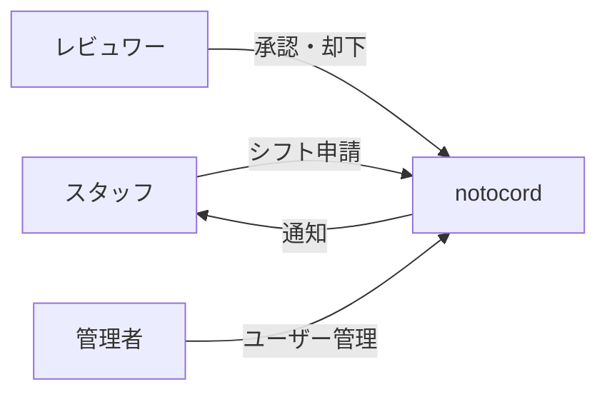

# プロジェクト概要

## notocord とは

notocord は、アルバイト・パートタイムスタッフ向けのシフト管理システムです。スタッフが自分のシフト希望を申請し、レビュワーや管理者が承認・調整を行うことで、効率的なシフト管理を実現します。

## 主な目的

1. **シフト申請の効率化**: スタッフが簡単にシフト希望を申請できる
2. **承認フローの標準化**: 一貫した承認プロセスを提供
3. **履歴の追跡**: すべての変更を履歴として記録
4. **権限に基づくアクセス制御**: ロールベースの適切な権限管理

## システムの概要

## 主要な機能

### スタッフ向け
- シフト希望の申請（Fix/Flex タイプ）
- 申請の編集・取り下げ
- 申請履歴の確認

### レビュワー向け
- シフト申請の承認・変更承認・却下
- 代理申請の作成
- スタッフ別の申請管理

### 管理者向け
- ユーザーの追加・編集
- ユーザーの有効/無効切り替え
- すべてのレビュワー機能

## 技術的特徴

| 分野 | 採用技術 |
|------|----------|
| フロントエンド | Next.js 16, React 19, Tailwind CSS |
| バックエンド | Supabase (PostgreSQL, Auth) |
| 状態管理 | Zustand |
| UI コンポーネント | Radix UI, shadcn/ui |
| 認証 | Supabase Auth (OTP/マジックリンク) |

## 動作環境

### 推奨ブラウザ
- Google Chrome（最新版）
- Firefox（最新版）
- Safari（最新版）
- Microsoft Edge（最新版）

### モバイル対応
- PWA (Progressive Web App) 対応
- iOS / Android のモバイルブラウザで動作

## ライセンス

本システムのライセンスについては、プロジェクトの LICENSE ファイルを参照してください。

## 関連ドキュメント

- [システムの特徴](02-features.md)
- [対象ユーザー](03-target-users.md)
- [セットアップガイド](../01-getting-started/01-setup.md)
