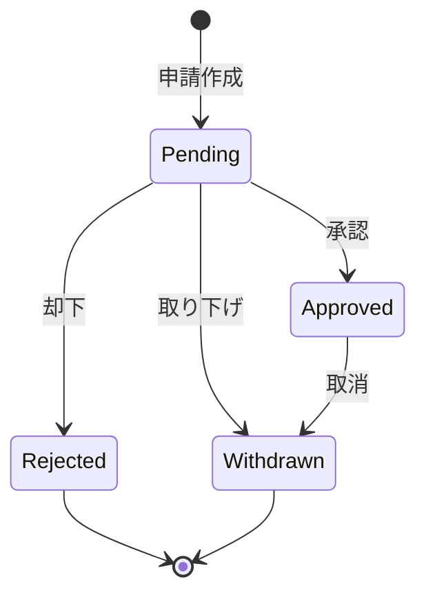

# システムの特徴

## 概要

notocord は、使いやすさとセキュリティを両立したモダンなシフト管理システムです。

## 主要な特徴

### 1. 直感的なユーザーインターフェース

- **シンプルなデザイン**: 誰でも迷わず操作できるクリーンな UI
- **日本語対応**: 完全な日本語インターフェース
- **レスポンシブ対応**: PC・タブレット・スマートフォンで最適表示
- **PWA 対応**: ホーム画面に追加してネイティブアプリのように利用可能

### 2. 柔軟なシフト申請タイプ

#### Fix タイプ（固定シフト）
- 特定の日時のシフトを申請
- 開始時刻と終了時刻を指定
- 最大8時間までの申請が可能
- 重複申請の自動検知

#### Flex タイプ（フレックスシフト）
- 週単位での希望時間を申請
- 1〜40時間の範囲で指定可能
- 同一週の重複申請を防止
- ISO週番号ベースの管理

### 3. 堅牢な承認ワークフロー

### 4. 完全な変更履歴

- すべての操作を履歴として記録
- 誰が・いつ・何を変更したかを追跡可能
- 変更理由の記録
- 監査対応

### 5. セキュリティファースト

| 機能 | 説明 |
|------|------|
| マジックリンク認証 | パスワードレスの安全なログイン |
| RLS (Row Level Security) | データベースレベルのアクセス制御 |
| ロールベース認可 | 役割に応じた機能制限 |
| セキュア RPC | 安全なデータベース操作 |

### 6. リアルタイム更新

- 申請状態の即座な反映
- キャッシュによる高速表示
- 必要に応じた強制リフレッシュ

### 7. 代理申請機能

- レビュワー・管理者による代理申請
- 即時承認での作成
- 履歴への代理作成記録

### 8. 警告・通知システム

- 直近シフトの取り下げ警告
- 申請時間外への変更警告
- 時間数増加の警告

## 技術的な特徴

### モダンな技術スタック

- **Next.js 16**: 最新の App Router を採用
- **React 19**: 最新の React バージョン
- **TypeScript**: 型安全な開発
- **Tailwind CSS 4**: ユーティリティファーストの CSS

### スケーラビリティ

- Supabase によるマネージドインフラ
- Vercel での簡単なデプロイ
- 自動スケーリング対応

### 開発者フレンドリー

- ESLint による一貫したコードスタイル
- コンポーネントベースのアーキテクチャ
- 充実したドキュメント

## 今後の展望

- 通知機能の強化
- レポート・分析機能
- カレンダー連携
- 外部システム統合

## 関連ドキュメント

- [プロジェクト概要](01-overview.md)
- [対象ユーザー](03-target-users.md)
- [技術スタック](../02-architecture/02-tech-stack.md)
