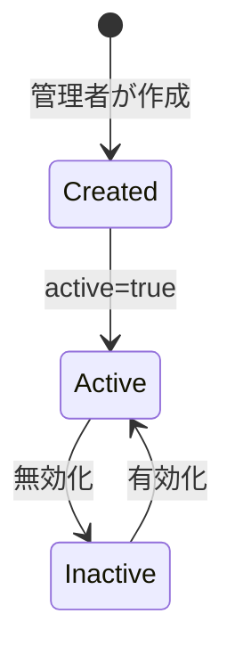

# 対象ユーザー

## ユーザーロール

notocord では、3つのユーザーロールを定義しています。各ロールには異なる権限と機能が付与されています。

## 1. スタッフ (staff)

### 概要
実際にシフトで働くアルバイト・パートタイムスタッフです。

### 主な責務
- 自身のシフト希望を申請
- 申請内容の確認・編集
- 必要に応じた申請の取り下げ

### 利用可能な機能

| 機能 | 説明 |
|------|------|
| シフト申請 | Fix または Flex タイプのシフトを申請 |
| 申請編集 | 保留中 (pending) の申請を編集 |
| 申請取り下げ | 理由を添えて申請を取り下げ |
| 履歴確認 | 自分の申請履歴を確認 |

### アクセス可能な画面
- `/home` - ホーム画面
- `/my` - 自分の申請一覧
- `/new` - 新規申請

### 申請タイプ
各スタッフには `request_type` が割り当てられています：
- **fix**: 固定シフト（日時指定）の申請のみ可能
- **flex**: フレックスシフト（週単位時間指定）の申請のみ可能

## 2. レビュワー (reviewer)

### 概要
スタッフのシフト申請を承認・管理する担当者です。

### 主な責務
- シフト申請の確認・承認・却下
- 必要に応じた申請内容の調整
- 代理申請の作成
- スタッフの申請状況の把握

### 利用可能な機能

| 機能 | 説明 |
|------|------|
| 申請承認 | 申請をそのまま承認 |
| 変更承認 | 申請内容を調整して承認 |
| 却下 | 申請を却下 |
| 代理申請 | スタッフに代わって申請を作成（即承認） |
| 承認取消 | 承認済み申請を取り消し |
| スタッフ別表示 | 各スタッフの申請を個別に確認 |

### アクセス可能な画面
- `/home` - ホーム画面
- `/review` - 承認管理
- `/shift/proxy` - 代理申請
- `/users` - スタッフ別詳細

## 3. 管理者 (admin)

### 概要
システム全体を管理する最上位権限のユーザーです。

### 主な責務
- ユーザーアカウントの管理
- すべての承認業務
- システム設定の管理

### 利用可能な機能
レビュワーのすべての機能に加えて：

| 機能 | 説明 |
|------|------|
| ユーザー追加 | 新規ユーザーを作成 |
| ユーザー編集 | ユーザー情報を更新 |
| 有効/無効切替 | ユーザーアカウントの有効化・無効化 |
| ロール変更 | ユーザーのロールを変更 |

### アクセス可能な画面
- レビュワーのすべての画面
- `/admin` - ユーザー管理

## ロール別機能マトリクス

| 機能 | スタッフ | レビュワー | 管理者 |
|------|:--------:|:----------:|:------:|
| シフト申請 | ✅ | - | - |
| 申請編集 | ✅ | - | - |
| 申請取り下げ | ✅ | - | - |
| 自分の履歴確認 | ✅ | ✅ | ✅ |
| 申請承認 | - | ✅ | ✅ |
| 変更承認 | - | ✅ | ✅ |
| 申請却下 | - | ✅ | ✅ |
| 代理申請 | - | ✅ | ✅ |
| 承認取消 | - | ✅ | ✅ |
| 全スタッフ確認 | - | ✅ | ✅ |
| ユーザー管理 | - | - | ✅ |

## 初回管理者のブートストラップ

システム初期状態では、`FIRST_ADMIN_EMAIL` 環境変数で指定されたメールアドレスが初回管理者として自動登録されます。

### 条件
1. `profiles` テーブルが空（ユーザーが0人）
2. ログイン試行のメールアドレスが `FIRST_ADMIN_EMAIL` と一致

## ユーザーのライフサイクル

## 関連ドキュメント

- [プロジェクト概要](01-overview.md)
- [ユーザー管理](../03-features/03-admin-management.md)
- [認証・認可](../02-architecture/04-auth.md)
