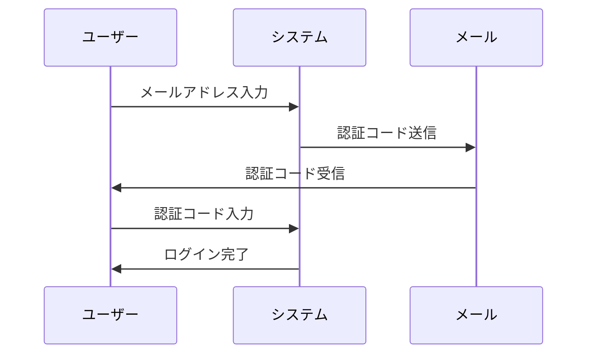

# 初回ログイン

## ログインフロー

notocord では、パスワードレス認証を採用しています。メールアドレスに送信される認証コード（OTP）またはマジックリンクを使用してログインします。

### ログイン手順

## 初回管理者のログイン

### 前提条件
- システムが初期状態（ユーザー0人）
- `FIRST_ADMIN_EMAIL` 環境変数が設定済み

### 手順

1. **ログイン画面にアクセス**
   - ブラウザで `/` にアクセス
   - ログイン画面が表示される

2. **メールアドレスを入力**
   - `FIRST_ADMIN_EMAIL` で設定したメールアドレスを入力
   - 「認証コードを送信」ボタンをクリック

3. **認証コードを確認**
   - メールボックスを確認
   - 6桁の認証コードを確認

4. **認証コードを入力**
   - 画面に認証コードを入力
   - 「ログイン」ボタンをクリック

5. **初期設定**
   - ログイン後、管理者としてのダッシュボードが表示
   - 必要に応じてユーザーを追加

## 一般ユーザーのログイン

### 前提条件
- 管理者によってアカウントが作成済み
- アカウントが有効（active = true）

### 手順

1. **ログイン画面にアクセス**
2. **登録されたメールアドレスを入力**
3. **認証コードをメールで受信**
4. **認証コードを入力してログイン**

## ログイン後の画面遷移

| ロール | 初期画面 | 説明 |
|--------|---------|------|
| staff | `/home` | ホーム画面（申請へのアクセス） |
| reviewer | `/home` | ホーム画面（承認へのアクセス） |
| admin | `/home` | ホーム画面（全機能へのアクセス） |

## ログアウト

### 手順
1. 画面右上のメニューをクリック
2. 「ログアウト」を選択
3. ログイン画面にリダイレクト

## セッション管理

### セッション期間
- デフォルトで Supabase の設定に従う
- 通常は数日〜数週間

### 自動ログアウト
- セッション期限切れ時に自動的にログアウト
- 再ログインが必要

## セキュリティ上の注意

### 認証コードについて
- 認証コードは一定時間で有効期限切れ
- 複数回の誤入力でロックアウトの可能性あり
- コードは他人と共有しない

### メールセキュリティ
- 認証メールは即座に削除推奨
- 公共の端末でのログインは控える
- 共有メールアカウントでの使用は非推奨

## トラブルシューティング

### 認証コードが届かない場合

1. **迷惑メールフォルダを確認**
   - 認証メールが迷惑メールに分類されている可能性

2. **メールアドレスを確認**
   - 入力したメールアドレスに誤りがないか確認

3. **再送信を試行**
   - 「認証コードを再送信」をクリック

4. **管理者に連絡**
   - アカウントが作成されているか確認

### 認証コードが認識されない場合

1. **正確に入力**
   - 数字のみ入力（スペースなし）

2. **有効期限を確認**
   - 時間が経過しすぎていないか確認

3. **新しいコードを取得**
   - 再送信して新しいコードを使用

### アカウントが無効の場合

- 管理者に連絡してアカウントの有効化を依頼

## 次のステップ

- [基本操作](04-basic-operations.md)
- [シフト申請（スタッフ）](../03-features/01-staff-requests.md)
- [シフト承認（レビュワー）](../03-features/02-reviewer-approval.md)

## 関連ドキュメント

- [セットアップガイド](01-setup.md)
- [認証・認可](../02-architecture/04-auth.md)
- [セキュリティ概要](../07-security/01-overview.md)
