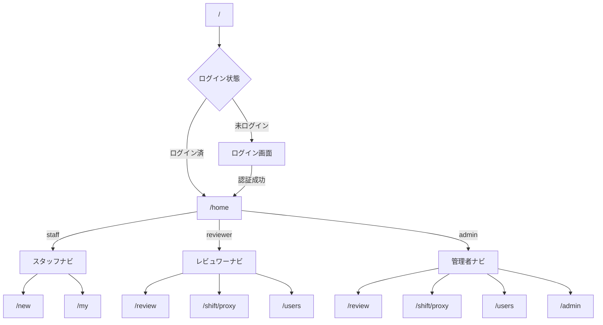

# 画面遷移ガイド

## 概要

notocord の画面遷移は、ユーザーロールによって異なります。本ガイドでは、各ロールの画面遷移フローを説明します。

## 画面遷移図



## スタッフの画面遷移

### メイン画面

```
/ (ルート)
  └── /home (ホーム)
        ├── /new (新規申請)
        └── /my (申請一覧)
              └── [申請詳細モーダル]
                    ├── [編集モーダル]
                    └── [取り下げ確認モーダル]
```

### 各画面の説明

| 画面 | パス | 説明 |
|------|------|------|
| ホーム | `/home` | ダッシュボード |
| 新規申請 | `/new` | シフト申請フォーム |
| 申請一覧 | `/my` | 自分の申請履歴 |

## レビュワーの画面遷移

### メイン画面

```
/ (ルート)
  └── /home (ホーム)
        ├── /review (承認管理)
        │     └── [承認モーダル]
        ├── /shift/proxy (代理申請)
        └── /users (スタッフ別)
              └── [ユーザー詳細]
                    └── [承認モーダル]
```

### 各画面の説明

| 画面 | パス | 説明 |
|------|------|------|
| ホーム | `/home` | ダッシュボード |
| 承認管理 | `/review` | 申請の承認・却下 |
| 代理申請 | `/shift/proxy` | スタッフ代理での申請作成 |
| スタッフ別 | `/users` | スタッフごとの申請確認 |

## 管理者の画面遷移

### メイン画面

```
/ (ルート)
  └── /home (ホーム)
        ├── /review (承認管理)
        │     └── [承認モーダル]
        ├── /shift/proxy (代理申請)
        ├── /users (スタッフ別)
        │     └── [ユーザー詳細]
        └── /admin (ユーザー管理)
              ├── [ユーザー追加モーダル]
              └── [ユーザー編集モーダル]
```

### 各画面の説明

| 画面 | パス | 説明 |
|------|------|------|
| ホーム | `/home` | ダッシュボード |
| 承認管理 | `/review` | 申請の承認・却下 |
| 代理申請 | `/shift/proxy` | スタッフ代理での申請作成 |
| スタッフ別 | `/users` | スタッフごとの申請確認 |
| ユーザー管理 | `/admin` | ユーザーの追加・編集・管理 |

## モーダル画面

### 申請詳細モーダル
- 表示元: `/my`, `/review`, `/users`
- 機能: 申請の詳細表示、編集、取り下げ

### 承認モーダル
- 表示元: `/review`, `/users`
- 機能: 承認、変更承認、却下

### ユーザー管理モーダル
- 表示元: `/admin`
- 機能: ユーザー追加、編集

### 取り下げ確認モーダル
- 表示元: 申請詳細
- 機能: 取り下げ理由入力、確認

## URL パラメータ

### クエリパラメータ

| パラメータ | 用途 | 例 |
|-----------|------|-----|
| `tab` | タブ切り替え | `/review?tab=all` |
| `user` | ユーザーフィルタ | `/users?user=xxx` |

## ディープリンク

特定の申請に直接アクセス：
```
/my?request=<request_id>
/review?request=<request_id>
```

## 不正アクセス時の動作

| 状況 | 動作 |
|------|------|
| 未認証でアクセス | ログイン画面へリダイレクト |
| 権限外の画面アクセス | ホームへリダイレクト |
| 無効なURLアクセス | 404エラー表示 |

## 関連ドキュメント

- [基本操作](04-basic-operations.md)
- [対象ユーザー](../00-introduction/03-target-users.md)
- [認証・認可](../02-architecture/04-auth.md)
