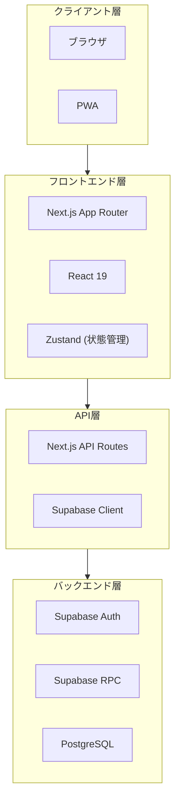
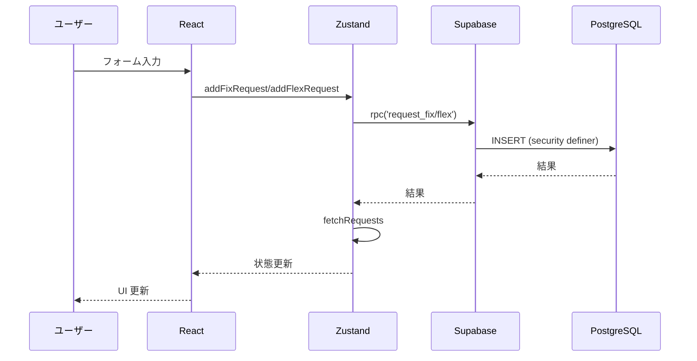
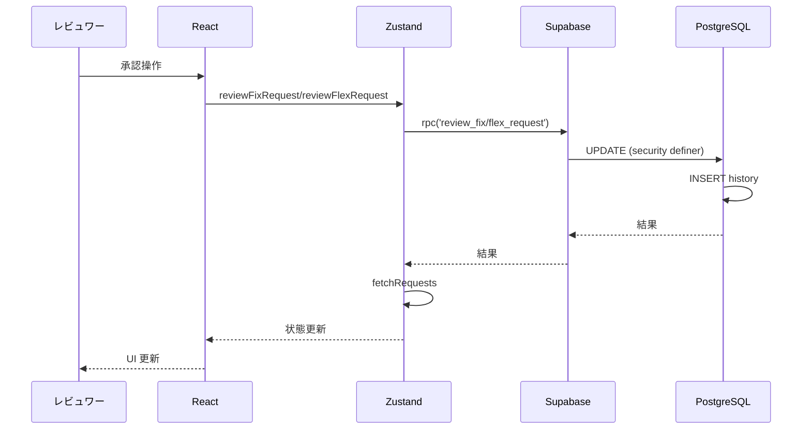
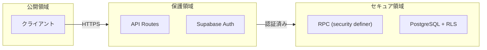

# システム構成

## 全体アーキテクチャ



## コンポーネント詳細

### クライアント層

| コンポーネント | 説明 |
|---------------|------|
| ブラウザ | Chrome, Firefox, Safari, Edge |
| PWA | Progressive Web App として動作 |

### フロントエンド層

| コンポーネント | 説明 |
|---------------|------|
| Next.js | App Router ベースのフレームワーク |
| React | UI ライブラリ |
| Zustand | 軽量な状態管理 |
| Radix UI | アクセシブルな UI プリミティブ |
| Tailwind CSS | ユーティリティファースト CSS |

### API層

| コンポーネント | 説明 |
|---------------|------|
| Next.js API Routes | サーバーサイド API エンドポイント |
| Supabase Client | Supabase との通信 |

### バックエンド層

| コンポーネント | 説明 |
|---------------|------|
| Supabase Auth | 認証・セッション管理 |
| Supabase RPC | データベース関数呼び出し |
| PostgreSQL | データストア |

## ディレクトリ構造

```
notocord-parttime/
├── app/                    # Next.js App Router
│   ├── admin/              # 管理画面
│   ├── api/                # API ルート
│   │   ├── admin/          # 管理 API
│   │   └── auth/           # 認証 API
│   ├── attendance/         # 出勤管理（予定）
│   ├── auth/               # 認証画面
│   ├── home/               # ホーム画面
│   ├── my/                 # 自分の申請
│   ├── new/                # 新規申請
│   ├── proxy/              # 代理申請
│   ├── review/             # 承認画面
│   ├── shift/              # シフト関連
│   ├── shifts/             # シフト一覧
│   └── users/              # ユーザー一覧
├── components/             # 共通コンポーネント
│   └── ui/                 # UI コンポーネント
├── design/                 # デザインシステム
├── docs/                   # ドキュメント
├── hooks/                  # カスタムフック
├── lib/                    # ユーティリティ
│   ├── auth/               # 認証ユーティリティ
│   └── supabase/           # Supabase クライアント
├── public/                 # 静的ファイル
├── scripts/                # ビルドスクリプト
├── styles/                 # グローバルスタイル
├── supabase/               # Supabase 設定
└── wiki/                   # Wiki ドキュメント
```

## データフロー

### 申請作成フロー



### 承認フロー



## セキュリティ境界



## 冗長性と可用性

### Supabase
- マネージドサービス
- 自動バックアップ
- 高可用性

### Vercel
- エッジネットワーク
- 自動スケーリング
- 99.99% SLA

## 関連ドキュメント

- [技術スタック](02-tech-stack.md)
- [データフロー](03-data-flow.md)
- [認証・認可](04-auth.md)
