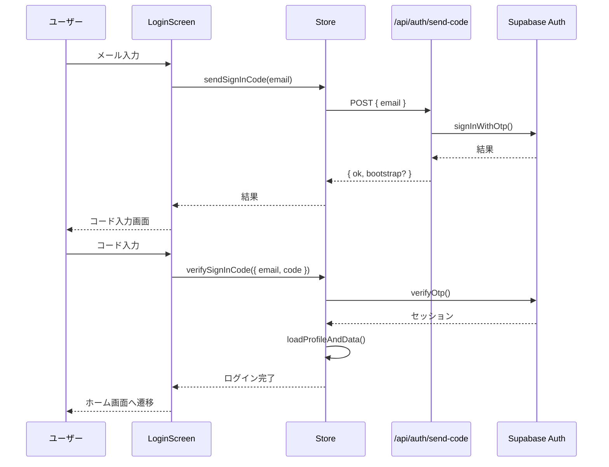
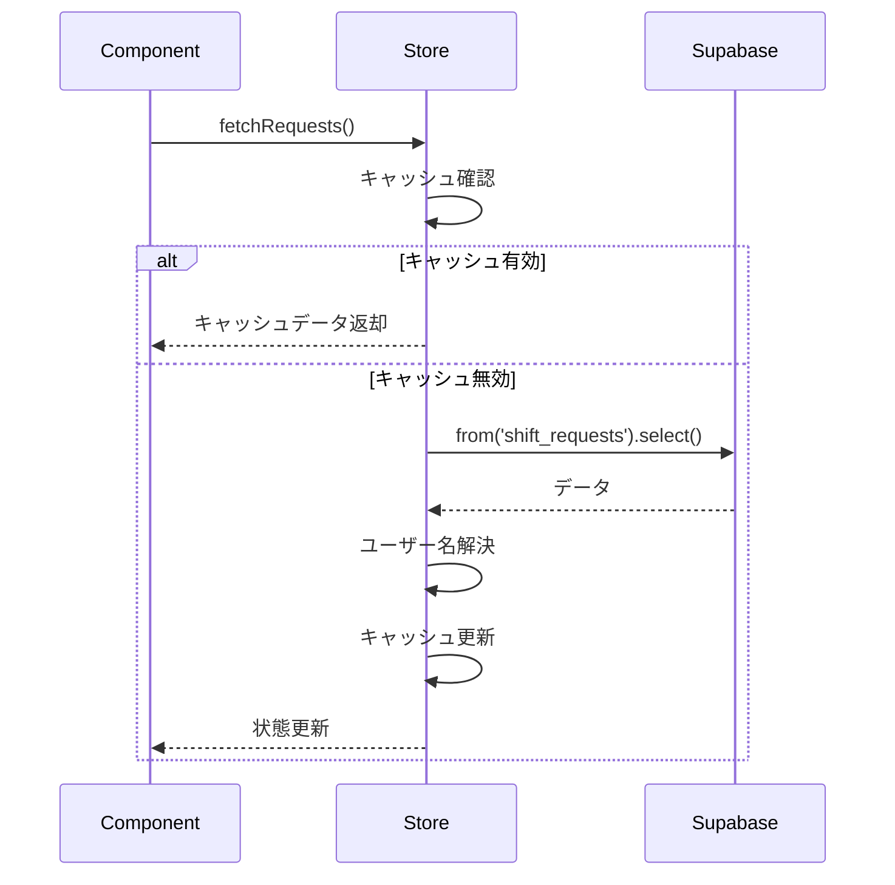
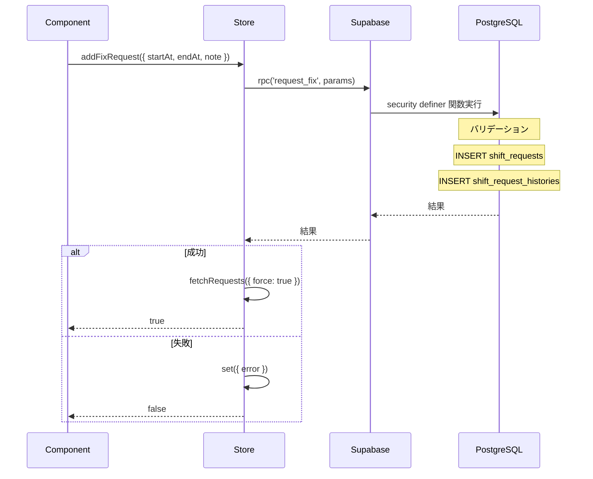
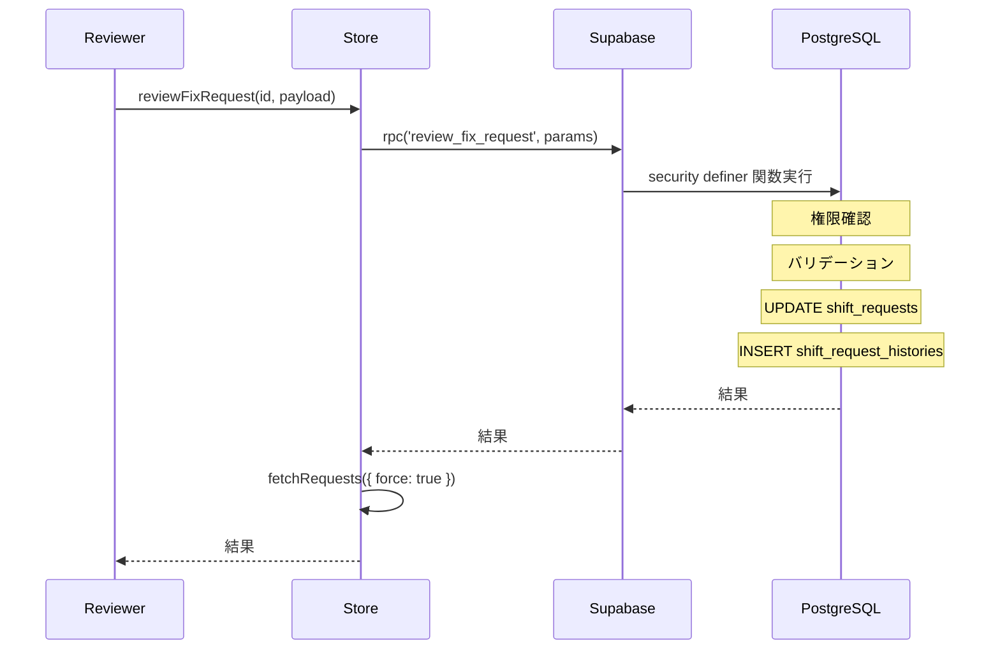
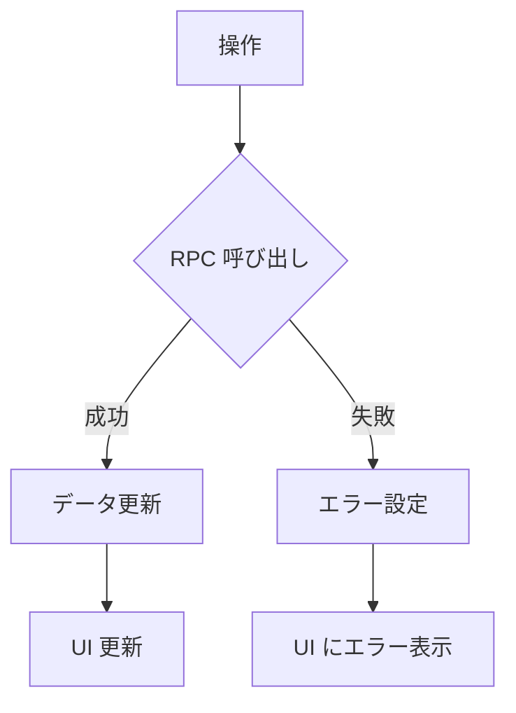

# データフロー

## 概要

notocord のデータフローは、クライアント側の状態管理（Zustand）とバックエンド（Supabase）の連携によって実現されています。

## 状態管理アーキテクチャ

### Zustand ストア構造

```typescript
interface AppState {
  // 認証
  currentUser: User | null;
  session: Session | null;
  
  // データ
  users: User[];
  requests: Request[];
  requestHistories: Record<string, RequestHistoryEntry[]>;
  
  // ローディング状態
  initialized: boolean;
  authLoading: boolean;
  dataLoading: boolean;
  
  // キャッシュ管理
  lastRequestsFetchedAt: number;
  lastUsersFetchedAt: number;
  
  // エラー
  error: string | null;
  
  // アクション
  init: () => Promise<void>;
  // ... その他のアクション
}
```

## 認証フロー

### ログインシーケンス



## データ取得フロー

### 申請一覧の取得



### キャッシュ戦略

| データ種別 | TTL | 説明 |
|-----------|-----|------|
| 申請一覧 | 15秒 | 頻繁な更新を反映 |
| ユーザー一覧 | 30秒 | 比較的安定したデータ |

## データ変更フロー

### 申請作成



### 承認処理



## リアルタイム更新

現在のバージョンでは、リアルタイム更新（Supabase Realtime）は使用していません。

### 更新トリガー
- ユーザーアクション後の強制リフレッシュ
- 画面遷移時のキャッシュ確認
- プルトゥリフレッシュ（モバイル）

## データ同期パターン

### Optimistic Update（楽観的更新）
現在は使用していません。すべての操作はサーバー確認後に UI を更新。

### Pessimistic Update（悲観的更新）
現在の実装パターン：
1. ユーザーアクション
2. ローディング表示
3. サーバー処理
4. 結果に基づく UI 更新

## エラーハンドリング

### エラーフロー



### エラーの種類

| エラー | 原因 | 対応 |
|--------|------|------|
| 認証エラー | セッション切れ | 再ログイン |
| バリデーションエラー | 入力値不正 | エラーメッセージ表示 |
| 権限エラー | 権限不足 | 操作不可表示 |
| ネットワークエラー | 接続問題 | リトライ案内 |

## パフォーマンス考慮

### データ量の制限
- 申請一覧: 全件取得（ページングなし）
- 履歴: 申請単位で遅延読み込み

### 最適化ポイント
- ユーザー名のバッチ解決
- キャッシュによる重複リクエスト防止
- インフライトリクエストの管理

## 関連ドキュメント

- [システム構成](01-system-overview.md)
- [RPC 関数](../05-api/03-rpc-functions.md)
- [スキーマ設計](../06-database/01-schema.md)
