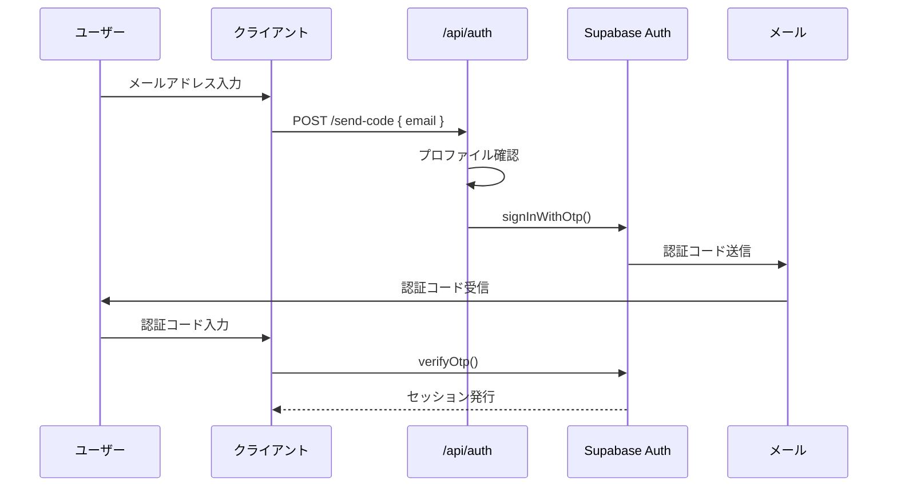
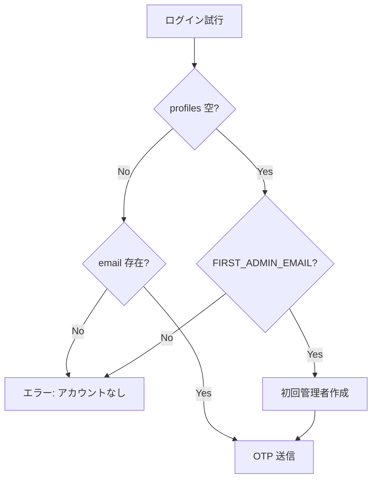

# 認証・認可

## 概要

notocord では、Supabase Auth を使用したパスワードレス認証と、ロールベースのアクセス制御を実装しています。

## 認証方式

### マジックリンク / OTP 認証



### 認証フローの詳細

#### 1. コード送信 (`/api/auth/send-code`)

```typescript
// リクエスト
POST /api/auth/send-code
{
  "email": "user@example.com"
}

// レスポンス（成功）
{
  "ok": true,
  "bootstrap": false  // 初回管理者の場合 true
}

// レスポンス（失敗）
{
  "ok": false,
  "error": "アカウントが見つかりません"
}
```

#### 2. コード検証

```typescript
// Supabase Auth で直接検証
await supabase.auth.verifyOtp({
  email: normalizedEmail,
  token: code,
  type: "email"
});
```

## 初回管理者のブートストラップ

### 条件
1. `profiles` テーブルが空
2. ログイン試行のメールが `FIRST_ADMIN_EMAIL` と一致

### フロー



## セッション管理

### セッションの保存
- Cookie ベースのセッション
- `@supabase/ssr` による管理

### クライアントサイド

```typescript
// lib/supabase/client.ts
import { createBrowserClient } from "@supabase/ssr";

export const supabase = createBrowserClient(
  process.env.NEXT_PUBLIC_SUPABASE_URL!,
  process.env.NEXT_PUBLIC_SUPABASE_ANON_KEY!
);
```

### サーバーサイド

```typescript
// lib/supabase/server.ts
import { createServerClient } from "@supabase/ssr";
import { cookies } from "next/headers";

export async function createClient() {
  const cookieStore = await cookies();
  
  return createServerClient(
    process.env.NEXT_PUBLIC_SUPABASE_URL!,
    process.env.NEXT_PUBLIC_SUPABASE_ANON_KEY!,
    {
      cookies: {
        getAll() { return cookieStore.getAll(); },
        setAll(cookiesToSet) { /* ... */ }
      }
    }
  );
}
```

## 認可（Authorization）

### ロールベースアクセス制御

| ロール | 説明 |
|--------|------|
| `staff` | 一般スタッフ |
| `reviewer` | 承認担当者 |
| `admin` | 管理者 |

### 権限マトリクス

| 機能 | staff | reviewer | admin |
|------|:-----:|:--------:|:-----:|
| 自分の申請作成 | ✅ | - | - |
| 自分の申請編集 | ✅ | - | - |
| 申請承認 | - | ✅ | ✅ |
| 代理申請 | - | ✅ | ✅ |
| ユーザー管理 | - | - | ✅ |

### UI レベルの認可

```typescript
// components/app-shell.tsx
const allowedTabs = useMemo(() => {
  const role = currentUser?.role;
  if (role === "admin") {
    return ["home", "review", "proxy", "users", "admin"];
  }
  if (role === "reviewer") {
    return ["home", "review", "proxy", "users"];
  }
  return ["home", "new", "my"];
}, [currentUser?.role]);
```

### RPC レベルの認可

```sql
-- 関数内でロールチェック
CREATE FUNCTION request_fix(...)
RETURNS uuid
LANGUAGE plpgsql
SECURITY DEFINER
AS $$
DECLARE
  v_role text;
BEGIN
  -- ロール取得
  SELECT role INTO v_role
  FROM profiles
  WHERE id = auth.uid();
  
  -- staff のみ許可
  IF v_role IS DISTINCT FROM 'staff' THEN
    RAISE EXCEPTION 'Permission denied';
  END IF;
  
  -- 処理続行...
END;
$$;
```

### RLS による認可

```sql
-- staff は自分の申請のみ参照可能
CREATE POLICY "staff_select_own"
ON shift_requests FOR SELECT
TO authenticated
USING (
  EXISTS (
    SELECT 1 FROM profiles
    WHERE id = auth.uid()
    AND role = 'staff'
    AND active = true
  )
  AND user_id = auth.uid()
);

-- reviewer/admin は全件参照可能
CREATE POLICY "reviewer_admin_select_all"
ON shift_requests FOR SELECT
TO authenticated
USING (
  EXISTS (
    SELECT 1 FROM profiles
    WHERE id = auth.uid()
    AND role IN ('reviewer', 'admin')
    AND active = true
  )
);
```

## セキュリティ考慮事項

### OTP の有効期限
- Supabase Auth のデフォルト設定に従う
- 通常 60 秒〜数分

### レート制限
- Supabase Auth の組み込みレート制限
- ブルートフォース攻撃対策

### 無効化されたユーザー
- `active = false` のユーザーはログイン不可
- 既存セッションも無効化

### service_role キーの保護
- サーバーサイドでのみ使用
- クライアントには公開しない

## トラブルシューティング

### 認証エラー

| エラー | 原因 | 対処 |
|--------|------|------|
| アカウントが見つかりません | 未登録メール | 管理者に連絡 |
| 認証コードが無効です | コード期限切れ/誤り | 再送信 |
| アカウントが無効です | active=false | 管理者に連絡 |

## 関連ドキュメント

- [初回ログイン](../01-getting-started/03-first-login.md)
- [セキュリティ概要](../07-security/01-overview.md)
- [RLS ポリシー](../06-database/02-rls.md)
