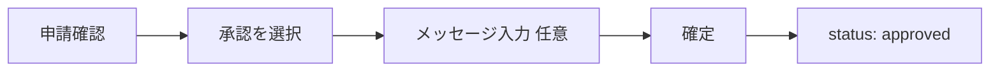
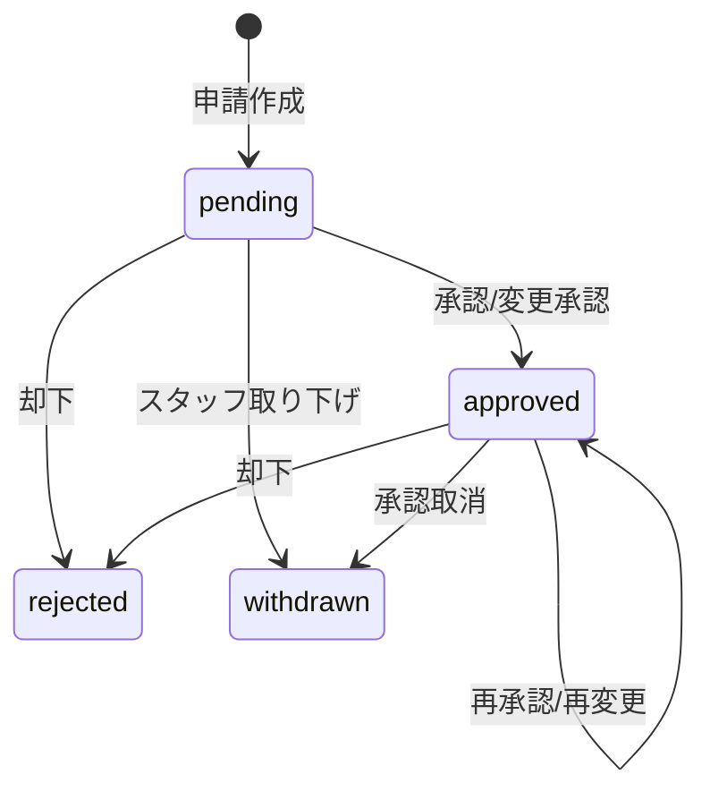

# シフト承認（レビュワー向け）

## 概要

レビュワーおよび管理者は、スタッフから提出されたシフト申請を確認し、承認・変更承認・却下を行います。

## 承認画面

### アクセス

1. ナビゲーションの「承認」タブをタップ
2. `/review` 画面が表示される

### タブ切り替え

| タブ | 表示内容 |
|------|---------|
| 承認待ち | ステータスが pending の申請 |
| すべて | すべての申請 |

### 検索機能

「すべて」タブでスタッフ名で検索可能：
- 検索ボックスに名前を入力
- 部分一致で絞り込み

## 申請の確認

### 一覧表示

```
┌─────────────────────────────┐
│ 承認待ち                     │
├─────────────────────────────┤
│ ┌─────────────────────────┐ │
│ │ 田中太郎                 │ │
│ │ 2026/03/01 09:00-17:00  │ │
│ │ 保留中                   │ │
│ └─────────────────────────┘ │
│ ┌─────────────────────────┐ │
│ │ 佐藤花子                 │ │
│ │ 第10週 20時間           │ │
│ │ 保留中                   │ │
│ └─────────────────────────┘ │
└─────────────────────────────┘
```

### 詳細モーダル

申請をタップすると詳細モーダルが表示されます。

## 承認操作

### 承認（そのまま承認）

申請内容をそのまま承認します。



#### 手順
1. 申請をタップ
2. 「承認」を選択
3. メッセージを入力（任意）
4. 「確定」をタップ

### 変更承認

申請内容を調整して承認します。

#### Fix の変更承認

```
┌─────────────────────────────┐
│ 変更承認                     │
├─────────────────────────────┤
│ 【申請内容】                 │
│ 09:00 - 17:00               │
│                             │
│ 【承認内容】                 │
│ 開始時刻: ┌───────┐         │
│          │ 10:00  │         │
│          └───────┘         │
│ 終了時刻: ┌───────┐         │
│          │ 18:00  │         │
│          └───────┘         │
│                             │
│ 変更理由（必須）             │
│ ┌─────────────────────────┐ │
│ │ シフト調整のため          │ │
│ └─────────────────────────┘ │
│                             │
│ メッセージ（任意）           │
│ ┌─────────────────────────┐ │
│ │                         │ │
│ └─────────────────────────┘ │
│                             │
│      ［ 確定 ］             │
└─────────────────────────────┘
```

##### 入力項目

| 項目 | 必須 | 説明 |
|------|:----:|------|
| 承認開始時刻 | ✅ | 変更後の開始時刻 |
| 承認終了時刻 | ✅ | 変更後の終了時刻 |
| 変更理由 | ✅ | 変更の理由 |
| メッセージ | - | スタッフへのコメント |

##### 警告表示

申請時間帯をはみ出す変更の場合：
- 承認開始時刻 < 申請開始時刻
- または 承認終了時刻 > 申請終了時刻

→ 「申請時間外への変更です。連絡を取ることを推奨します」

#### Flex の変更承認

```
┌─────────────────────────────┐
│ 変更承認                     │
├─────────────────────────────┤
│ 【申請内容】                 │
│ 第10週: 20時間              │
│                             │
│ 【承認内容】                 │
│ 承認時間数: ┌───────┐       │
│            │ 15     │ 時間  │
│            └───────┘       │
│                             │
│ メッセージ（任意）           │
│ ┌─────────────────────────┐ │
│ │                         │ │
│ └─────────────────────────┘ │
│                             │
│      ［ 確定 ］             │
└─────────────────────────────┘
```

##### 入力項目

| 項目 | 必須 | 説明 |
|------|:----:|------|
| 承認時間数 | ✅ | 1〜40時間 |
| メッセージ | - | スタッフへのコメント |

##### 警告表示

時間数を増加させる場合：
- 承認時間数 > 申請時間数

→ 「希望より多い時間数です。連絡を取ることを推奨します」

### 却下

申請を却下します。

#### 手順
1. 申請をタップ
2. 「却下」を選択
3. メッセージを入力（任意）
4. 「確定」をタップ

## 承認済み申請の再処理

### 編集して再確定

承認済み（approved）の申請を再度編集できます。

#### 手順
1. 承認済みの申請をタップ
2. 内容を変更
3. 「確定」をタップ

### 承認取消

承認済みの申請を取り消します（withdrawn に変更）。

#### 手順
1. 承認済みの申請をタップ
2. 「取り消し」を選択
3. 取消理由を入力（必須）
4. 「確定」をタップ

#### 警告表示

直近2日以内のシフトを取り消す場合、警告が表示されます。

## スタッフ別表示

### アクセス

1. ナビゲーションの「スタッフ」タブをタップ
2. `/users` 画面が表示される

### 機能

- スタッフ一覧から選択
- 選択したスタッフの申請履歴を表示
- 申請をタップして承認モーダルを表示

## ステータス遷移



## 決定タイプ

| 決定タイプ | 説明 |
|-----------|------|
| approve | そのまま承認 |
| modify | 変更して承認 |
| reject | 却下 |

※ Flex の過去データには `partial` が含まれる場合がありますが、新規操作では `modify` に統一されています。

## ベストプラクティス

### 1. 迅速な対応
- 申請は可能な限り早く処理
- 保留が長いと運用に影響

### 2. 明確なメッセージ
- 却下・変更時はできるだけ理由を記載
- スタッフの理解を促進

### 3. 警告への対応
- 警告が表示された場合は内容を確認
- 必要に応じてスタッフに連絡

## 関連ドキュメント

- [シフト申請（スタッフ向け）](01-staff-requests.md)
- [代理申請](04-proxy-creation.md)
- [基本操作](../01-getting-started/04-basic-operations.md)
