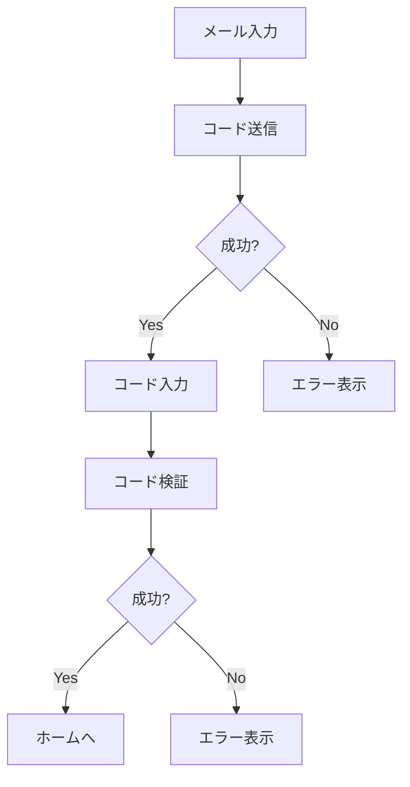
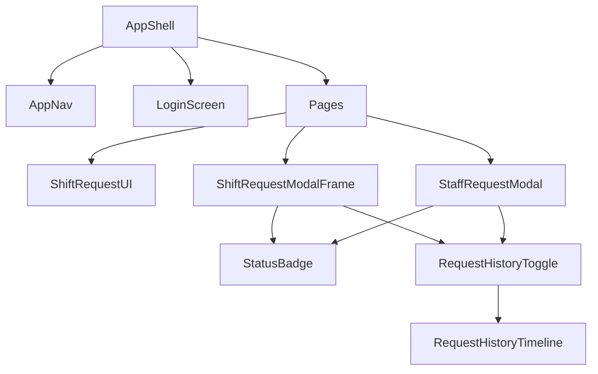

# カスタムコンポーネント

## 概要

notocord 固有の機能を実装するカスタムコンポーネントについて説明します。

## AppShell

アプリケーション全体のレイアウトを管理するコンポーネント。

### 役割
- ロールに基づくナビゲーション表示
- 認証状態の確認
- レイアウトの統一

### 使用例

```tsx
import { AppShell } from "@/components/app-shell";

function Layout({ children }) {
  return (
    <AppShell>
      {children}
    </AppShell>
  );
}
```

### 内部ロジック

```tsx
// ロールに基づくタブ表示
const allowedTabs = useMemo(() => {
  const role = currentUser?.role;
  if (role === "admin") {
    return ["home", "review", "proxy", "users", "admin"];
  }
  if (role === "reviewer") {
    return ["home", "review", "proxy", "users"];
  }
  return ["home", "new", "my"];
}, [currentUser?.role]);
```

## LoginScreen

ログイン画面のコンポーネント。

### 機能
- メールアドレス入力
- 認証コード送信
- 認証コード検証

### ステート管理

```tsx
interface LoginScreenState {
  step: "email" | "code";
  email: string;
  code: string;
  loading: boolean;
  error: string | null;
}
```

### フロー



## StatusBadge

申請ステータスを表示するバッジコンポーネント。

### 使用例

```tsx
import { StatusBadge } from "@/components/status-badge";

<StatusBadge status="pending" />
<StatusBadge status="approved" />
<StatusBadge status="rejected" />
<StatusBadge status="withdrawn" />
```

### ステータス別表示

| ステータス | 色 | 表示テキスト |
|-----------|-----|-------------|
| pending | 黄色 | 保留中 |
| approved | 緑 | 確定 |
| rejected | 赤 | 却下 |
| withdrawn | グレー | 取り下げ |

## RequestHistoryTimeline

申請の変更履歴をタイムライン形式で表示。

### 使用例

```tsx
import { RequestHistoryTimeline } from "@/components/request-history-timeline";

<RequestHistoryTimeline
  histories={histories}
  loading={loading}
/>
```

### Props

| プロパティ | 型 | 説明 |
|-----------|-----|------|
| histories | RequestHistoryEntry[] | 履歴データ |
| loading | boolean | ローディング状態 |

### 表示形式

```
┌─────────────────────────────┐
│ 2026/02/25 14:00            │
│ ● 承認 by 管理者A            │
│   → 確定（承認）             │
│   メッセージ: よろしく...     │
├─────────────────────────────┤
│ 2026/02/25 10:00            │
│ ○ 作成 by 田中太郎           │
│   → 保留中                  │
└─────────────────────────────┘
```

## RequestHistoryToggle

履歴表示の開閉を管理するトグルコンポーネント。

### 使用例

```tsx
import { RequestHistoryToggle } from "@/components/request-history-toggle";

<RequestHistoryToggle requestId={request.id}>
  <RequestHistoryTimeline histories={histories} />
</RequestHistoryToggle>
```

### 機能
- 履歴の遅延読み込み
- 開閉状態の管理
- アニメーション付き展開

## ShiftRequestUI

シフト申請フォームの UI コンポーネント。

### Fix タイプ

```tsx
<ShiftRequestUI
  type="fix"
  onSubmit={handleSubmit}
  defaultValues={{
    date: new Date(),
    startTime: "09:00",
    endTime: "17:00",
  }}
/>
```

### Flex タイプ

```tsx
<ShiftRequestUI
  type="flex"
  onSubmit={handleSubmit}
  defaultValues={{
    week: currentWeek,
    hours: 20,
  }}
/>
```

## ShiftRequestModalFrame

申請詳細のモーダルフレーム。

### 使用例

```tsx
<ShiftRequestModalFrame
  request={request}
  open={open}
  onOpenChange={setOpen}
  onEdit={handleEdit}
  onWithdraw={handleWithdraw}
/>
```

### Props

| プロパティ | 型 | 説明 |
|-----------|-----|------|
| request | Request | 申請データ |
| open | boolean | 開閉状態 |
| onOpenChange | function | 開閉ハンドラ |
| onEdit | function | 編集ハンドラ |
| onWithdraw | function | 取り下げハンドラ |

## DateInput

日付入力コンポーネント。

### 使用例

```tsx
import { DateInput } from "@/components/date-input";

<DateInput
  value={date}
  onChange={setDate}
  placeholder="日付を選択"
/>
```

### 機能
- カレンダーポップオーバー
- 手入力対応
- 日本語表示

## SelectField

ラベル付きセレクトフィールド。

### 使用例

```tsx
import { SelectField } from "@/components/select-field";

<SelectField
  label="対象週"
  value={week}
  onChange={setWeek}
  options={weekOptions}
  placeholder="選択してください"
/>
```

### Props

| プロパティ | 型 | 説明 |
|-----------|-----|------|
| label | string | ラベル |
| value | string | 選択値 |
| onChange | function | 変更ハンドラ |
| options | Option[] | 選択肢 |
| placeholder | string | プレースホルダー |

## NearTermContactWarning

直近シフトの警告コンポーネント。

### 使用例

```tsx
import { NearTermContactWarning } from "@/components/near-term-contact-warning";

{isNearTerm && (
  <NearTermContactWarning />
)}
```

### 表示内容

```
⚠️ 直近のシフトです。連絡を取ることを推奨します。
```

## StaffRequestModal

レビュワー向けの申請処理モーダル。

### 機能
- 申請詳細の表示
- 承認/変更承認/却下の選択
- メッセージ入力
- 履歴表示

### 使用例

```tsx
<StaffRequestModal
  request={request}
  open={open}
  onOpenChange={setOpen}
  onReview={handleReview}
/>
```

## コンポーネント間の関係



## 関連ドキュメント

- [コンポーネント概要](01-overview.md)
- [UI コンポーネント詳細](02-ui-components.md)
- [状態管理設計](../02-architecture/05-state-management.md)
