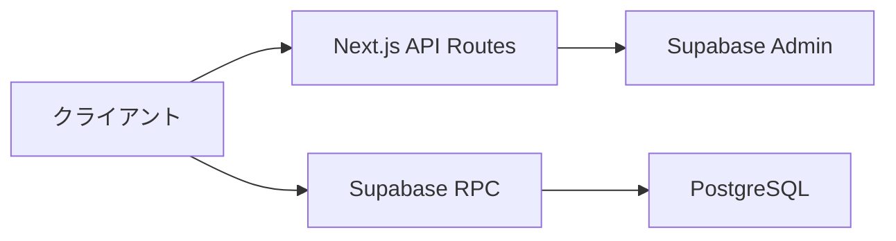

# API 概要

## 概要

notocord の API は、Next.js API Routes と Supabase RPC で構成されています。

## API アーキテクチャ



## API の種類

### 1. Next.js API Routes

サーバーサイドで実行される REST API エンドポイント。

| パス | 用途 |
|------|------|
| `/api/auth/send-code` | 認証コード送信 |
| `/api/auth/verify-code` | 認証コード検証 |
| `/api/auth/magic-link` | マジックリンク送信 |
| `/api/admin/users` | ユーザー管理 |

### 2. Supabase RPC

PostgreSQL 関数を直接呼び出す。

| 関数 | 用途 |
|------|------|
| `request_fix` | Fix 申請作成 |
| `request_flex` | Flex 申請作成 |
| `update_fix_request` | Fix 申請編集 |
| `update_flex_request` | Flex 申請編集 |
| `withdraw_request` | 申請取り下げ |
| `review_fix_request` | Fix 承認 |
| `review_flex_request` | Flex 承認 |
| `cancel_approved_request` | 承認取消 |
| `proxy_create_fix_request` | Fix 代理作成 |
| `proxy_create_flex_request` | Flex 代理作成 |

## 認証

### API Routes の認証

Bearer トークンによる認証：

```typescript
// リクエストヘッダー
Authorization: Bearer <access_token>
```

### Supabase RPC の認証

Supabase セッションによる自動認証。`auth.uid()` で現在のユーザー ID を取得。

## レスポンス形式

### 成功レスポンス

```json
{
  "ok": true,
  "data": {
    // レスポンスデータ
  }
}
```

### エラーレスポンス

```json
{
  "ok": false,
  "error": "エラーメッセージ"
}
```

### HTTP ステータスコード

| コード | 意味 |
|--------|------|
| 200 | 成功 |
| 201 | 作成成功 |
| 400 | リクエストエラー |
| 401 | 認証エラー |
| 403 | 権限エラー |
| 404 | 未検出 |
| 500 | サーバーエラー |

## セキュリティ

### CORS

- 同一オリジンのみ許可
- Next.js のデフォルト設定

### レート制限

- Supabase Auth の組み込み制限
- 必要に応じてカスタム制限を追加

### 入力検証

- サーバーサイドでのバリデーション
- Zod スキーマによる型チェック

## エンドポイント一覧

### 認証 API

| メソッド | パス | 説明 |
|---------|------|------|
| POST | `/api/auth/send-code` | 認証コード送信 |
| POST | `/api/auth/verify-code` | 認証コード検証 |
| POST | `/api/auth/magic-link` | マジックリンク送信 |

### 管理 API

| メソッド | パス | 説明 |
|---------|------|------|
| POST | `/api/admin/users` | ユーザー作成 |
| PATCH | `/api/admin/users` | ユーザー更新 |

### Supabase RPC

| 関数 | 説明 |
|------|------|
| `request_fix` | Fix 申請作成 |
| `request_flex` | Flex 申請作成 |
| `update_fix_request` | Fix 申請編集 |
| `update_flex_request` | Flex 申請編集 |
| `withdraw_request` | 申請取り下げ |
| `review_fix_request` | Fix 承認 |
| `review_flex_request` | Flex 承認 |
| `cancel_approved_request` | 承認取消 |
| `proxy_create_fix_request` | Fix 代理作成 |
| `proxy_create_flex_request` | Flex 代理作成 |
| `reopen_fix_request` | Fix 再申請 |
| `reopen_flex_request` | Flex 再申請 |

## クライアントからの呼び出し

### API Routes

```typescript
const response = await fetch("/api/auth/send-code", {
  method: "POST",
  headers: { "Content-Type": "application/json" },
  body: JSON.stringify({ email }),
});
const data = await response.json();
```

### Supabase RPC

```typescript
const { data, error } = await supabase.rpc("request_fix", {
  start_at: startAt,
  end_at: endAt,
  note: note ?? null,
});
```

## エラーハンドリング

### API Routes

```typescript
try {
  const response = await fetch("/api/admin/users", { ... });
  if (!response.ok) {
    const error = await response.json();
    throw new Error(error.error || "エラーが発生しました");
  }
  const data = await response.json();
  return data;
} catch (error) {
  console.error(error);
  // エラー処理
}
```

### Supabase RPC

```typescript
const { data, error } = await supabase.rpc("request_fix", { ... });
if (error) {
  console.error(error.message);
  // エラー処理
  return;
}
// 成功処理
```

## 関連ドキュメント

- [認証 API](02-auth-api.md)
- [RPC 関数](03-rpc-functions.md)
- [管理 API](04-admin-api.md)
