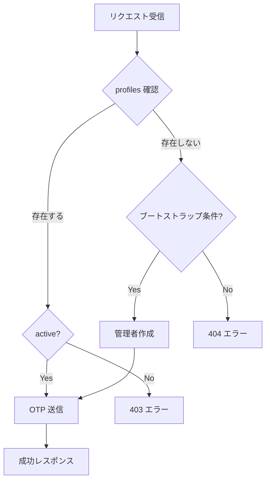

# 認証 API

## 概要

notocord の認証 API は、パスワードレス認証（OTP / マジックリンク）を提供します。

## エンドポイント

### POST /api/auth/send-code

認証コードをメールで送信します。

#### リクエスト

```http
POST /api/auth/send-code
Content-Type: application/json

{
  "email": "user@example.com"
}
```

#### パラメータ

| パラメータ | 型 | 必須 | 説明 |
|-----------|-----|:----:|------|
| email | string | ✅ | ユーザーのメールアドレス |

#### レスポンス

##### 成功 (200)

```json
{
  "ok": true,
  "bootstrap": false
}
```

| フィールド | 型 | 説明 |
|-----------|-----|------|
| ok | boolean | 処理成功 |
| bootstrap | boolean | 初回管理者として作成されたか |

##### エラー (404)

```json
{
  "ok": false,
  "error": "アカウントが見つかりません"
}
```

##### エラー (403)

```json
{
  "ok": false,
  "error": "アカウントが無効です"
}
```

#### 処理フロー



### POST /api/auth/magic-link

マジックリンクをメールで送信します（代替認証方式）。

#### リクエスト

```http
POST /api/auth/magic-link
Content-Type: application/json

{
  "email": "user@example.com"
}
```

#### パラメータ

| パラメータ | 型 | 必須 | 説明 |
|-----------|-----|:----:|------|
| email | string | ✅ | ユーザーのメールアドレス |

#### レスポンス

##### 成功 (200)

```json
{
  "ok": true
}
```

##### エラー (404)

```json
{
  "error": "アカウントが見つかりません"
}
```

## クライアント側の認証フロー

### 1. コード送信

```typescript
const sendSignInCode = async (email: string) => {
  const res = await fetch("/api/auth/send-code", {
    method: "POST",
    headers: { "Content-Type": "application/json" },
    body: JSON.stringify({ email }),
  });
  const data = await res.json();
  
  if (!res.ok) {
    return { ok: false, error: data.error };
  }
  
  return { ok: true, bootstrap: data.bootstrap };
};
```

### 2. コード検証

```typescript
const verifySignInCode = async (email: string, code: string) => {
  const normalizedEmail = email.trim().toLowerCase();
  const token = code.replace(/\D/g, ""); // 数字のみ抽出
  
  const { error } = await supabase.auth.verifyOtp({
    email: normalizedEmail,
    token,
    type: "email",
  });
  
  if (error) {
    return { ok: false, error: error.message };
  }
  
  return { ok: true };
};
```

## 初回管理者のブートストラップ

### 条件

1. `profiles` テーブルが空（ユーザーが 0 人）
2. リクエストのメールアドレスが `FIRST_ADMIN_EMAIL` 環境変数と一致

### 処理

```typescript
// /api/auth/send-code の内部処理（擬似コード）
if (profileCount === 0 && email === process.env.FIRST_ADMIN_EMAIL) {
  // 管理者プロファイルを作成
  await createAdminProfile(email);
  return { ok: true, bootstrap: true };
}
```

## 環境変数

| 変数名 | 説明 |
|--------|------|
| `FIRST_ADMIN_EMAIL` | 初回管理者のメールアドレス |
| `NEXT_PUBLIC_SUPABASE_URL` | Supabase プロジェクト URL |
| `NEXT_PUBLIC_SUPABASE_ANON_KEY` | Supabase 匿名キー |
| `SUPABASE_SERVICE_ROLE_KEY` | Supabase サービスロールキー |

## セキュリティ考慮事項

### OTP の有効期限

- Supabase Auth のデフォルト設定に従う
- 通常 60 秒〜数分

### レート制限

- Supabase Auth の組み込みレート制限
- 過度なリクエストはブロックされる

### メールの検証

- 登録されていないメールアドレスは拒否
- `shouldCreateUser: false` で自動登録を防止

```typescript
await supabase.auth.signInWithOtp({
  email,
  options: {
    shouldCreateUser: false,
  },
});
```

## エラーハンドリング

### 一般的なエラー

| エラー | 原因 | 対処 |
|--------|------|------|
| アカウントが見つかりません | 未登録メール | 管理者に連絡 |
| アカウントが無効です | active=false | 管理者に連絡 |
| 認証コードが無効です | コード期限切れ/誤り | 再送信 |
| リクエストが多すぎます | レート制限 | しばらく待つ |

### トラブルシューティング

#### コードが届かない

1. 迷惑メールフォルダを確認
2. メールアドレスが正しいか確認
3. 再送信を試行

#### コードが認識されない

1. 正確に入力（数字のみ）
2. 有効期限を確認
3. 新しいコードを取得

## 関連ドキュメント

- [API 概要](01-overview.md)
- [認証・認可](../02-architecture/04-auth.md)
- [初回ログイン](../01-getting-started/03-first-login.md)
