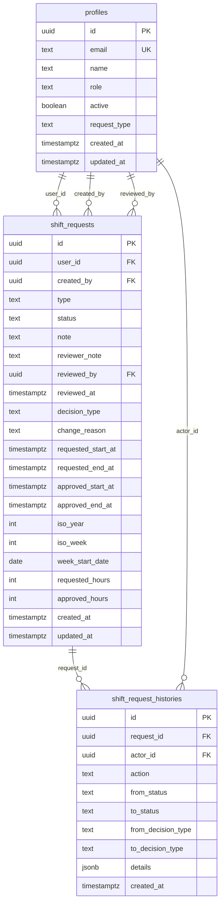

# スキーマ設計

## 概要

notocord のデータベースは PostgreSQL (Supabase) を使用しています。本ドキュメントでは、テーブル設計と制約について説明します。

## ER図



## テーブル定義

### profiles

ユーザー情報を格納するテーブル。

```sql
CREATE TABLE profiles (
  id uuid PRIMARY KEY REFERENCES auth.users(id) ON DELETE CASCADE,
  email text UNIQUE NOT NULL,
  name text NOT NULL,
  role text NOT NULL CHECK (role IN ('admin', 'reviewer', 'staff')),
  active boolean NOT NULL DEFAULT true,
  request_type text NOT NULL DEFAULT 'fix' CHECK (request_type IN ('fix', 'flex')),
  created_at timestamptz NOT NULL DEFAULT now(),
  updated_at timestamptz NOT NULL DEFAULT now()
);
```

#### カラム

| カラム | 型 | NULL | 説明 |
|--------|-----|:----:|------|
| id | uuid | ✗ | auth.users の外部キー |
| email | text | ✗ | メールアドレス（一意） |
| name | text | ✗ | 表示名 |
| role | text | ✗ | admin / reviewer / staff |
| active | boolean | ✗ | 有効フラグ |
| request_type | text | ✗ | fix / flex |
| created_at | timestamptz | ✗ | 作成日時 |
| updated_at | timestamptz | ✗ | 更新日時 |

### shift_requests

シフト申請を格納するテーブル。

```sql
CREATE TABLE shift_requests (
  id uuid PRIMARY KEY DEFAULT gen_random_uuid(),
  user_id uuid NOT NULL REFERENCES profiles(id),
  created_by uuid NOT NULL REFERENCES profiles(id),
  type text NOT NULL CHECK (type IN ('fix', 'flex')),
  status text NOT NULL DEFAULT 'pending' CHECK (status IN ('pending', 'approved', 'rejected', 'withdrawn')),
  note text,
  reviewer_note text,
  reviewed_by uuid REFERENCES profiles(id),
  reviewed_at timestamptz,
  decision_type text CHECK (decision_type IN ('approve', 'modify', 'partial', 'reject')),
  change_reason text,
  
  -- Fix タイプ用
  requested_start_at timestamptz,
  requested_end_at timestamptz,
  approved_start_at timestamptz,
  approved_end_at timestamptz,
  
  -- Flex タイプ用
  iso_year integer,
  iso_week integer,
  week_start_date date,
  requested_hours integer CHECK (requested_hours > 0),
  approved_hours integer CHECK (approved_hours > 0),
  
  created_at timestamptz NOT NULL DEFAULT now(),
  updated_at timestamptz NOT NULL DEFAULT now(),
  
  -- 制約
  CONSTRAINT fix_times_valid CHECK (
    type != 'fix' OR requested_start_at < requested_end_at
  ),
  CONSTRAINT fix_modify_reason CHECK (
    type != 'fix' OR decision_type != 'modify' OR change_reason IS NOT NULL
  )
);
```

#### カラム（共通）

| カラム | 型 | NULL | 説明 |
|--------|-----|:----:|------|
| id | uuid | ✗ | 主キー |
| user_id | uuid | ✗ | 申請者 |
| created_by | uuid | ✗ | 作成者（本人または代理） |
| type | text | ✗ | fix / flex |
| status | text | ✗ | pending / approved / rejected / withdrawn |
| note | text | ✓ | 申請者メッセージ |
| reviewer_note | text | ✓ | レビュワーメッセージ |
| reviewed_by | uuid | ✓ | レビュワー |
| reviewed_at | timestamptz | ✓ | レビュー日時 |
| decision_type | text | ✓ | approve / modify / partial / reject |
| change_reason | text | ✓ | 変更理由（Fix modify時必須） |

#### カラム（Fix タイプ）

| カラム | 型 | NULL | 説明 |
|--------|-----|:----:|------|
| requested_start_at | timestamptz | ✓ | 申請開始日時 |
| requested_end_at | timestamptz | ✓ | 申請終了日時 |
| approved_start_at | timestamptz | ✓ | 承認開始日時 |
| approved_end_at | timestamptz | ✓ | 承認終了日時 |

#### カラム（Flex タイプ）

| カラム | 型 | NULL | 説明 |
|--------|-----|:----:|------|
| iso_year | integer | ✓ | ISO年 |
| iso_week | integer | ✓ | ISO週番号 |
| week_start_date | date | ✓ | 週開始日（月曜） |
| requested_hours | integer | ✓ | 申請時間数 |
| approved_hours | integer | ✓ | 承認時間数 |

### shift_request_histories

申請の変更履歴を格納するテーブル。

```sql
CREATE TABLE shift_request_histories (
  id uuid PRIMARY KEY DEFAULT gen_random_uuid(),
  request_id uuid NOT NULL REFERENCES shift_requests(id),
  actor_id uuid REFERENCES profiles(id),
  action text NOT NULL CHECK (action IN ('create', 'proxy_create', 'update', 'withdraw', 'review', 'reopen')),
  from_status text,
  to_status text,
  from_decision_type text,
  to_decision_type text,
  details jsonb,
  created_at timestamptz NOT NULL DEFAULT now()
);
```

#### カラム

| カラム | 型 | NULL | 説明 |
|--------|-----|:----:|------|
| id | uuid | ✗ | 主キー |
| request_id | uuid | ✗ | 申請ID |
| actor_id | uuid | ✓ | 実行者 |
| action | text | ✗ | アクション種別 |
| from_status | text | ✓ | 変更前ステータス |
| to_status | text | ✓ | 変更後ステータス |
| from_decision_type | text | ✓ | 変更前決定タイプ |
| to_decision_type | text | ✓ | 変更後決定タイプ |
| details | jsonb | ✓ | 詳細情報 |
| created_at | timestamptz | ✗ | 作成日時 |

## インデックス

### Flex 一意性インデックス

同一ユーザー・同一週の pending/approved 申請を1つに制限：

```sql
CREATE UNIQUE INDEX shift_requests_flex_unique
ON shift_requests (user_id, iso_year, iso_week)
WHERE type = 'flex' AND status IN ('pending', 'approved');
```

### パフォーマンス用インデックス

```sql
-- ユーザー別申請検索
CREATE INDEX idx_shift_requests_user_id ON shift_requests(user_id);

-- ステータス別検索
CREATE INDEX idx_shift_requests_status ON shift_requests(status);

-- 履歴の申請別検索
CREATE INDEX idx_shift_request_histories_request_id ON shift_request_histories(request_id);
```

## トリガー

### updated_at 自動更新

```sql
CREATE OR REPLACE FUNCTION update_updated_at()
RETURNS TRIGGER AS $$
BEGIN
  NEW.updated_at = now();
  RETURN NEW;
END;
$$ LANGUAGE plpgsql;

CREATE TRIGGER trigger_profiles_updated_at
BEFORE UPDATE ON profiles
FOR EACH ROW EXECUTE FUNCTION update_updated_at();

CREATE TRIGGER trigger_shift_requests_updated_at
BEFORE UPDATE ON shift_requests
FOR EACH ROW EXECUTE FUNCTION update_updated_at();
```

## 関連ドキュメント

- [RLS ポリシー](02-rls.md)
- [マイグレーション](03-migrations.md)
- [RPC 関数](../05-api/03-rpc-functions.md)
