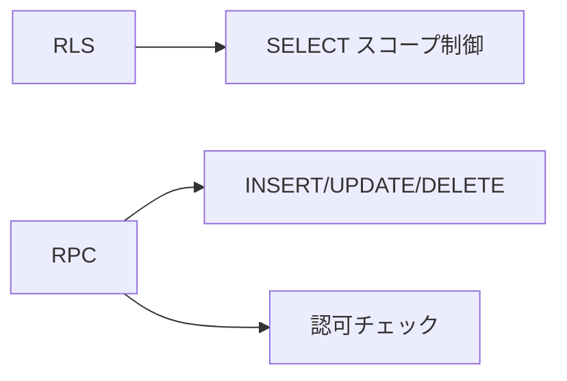
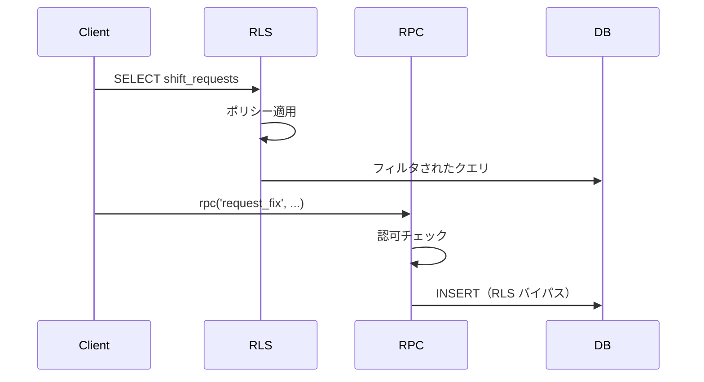

# RLS ポリシー

## 概要

Row Level Security (RLS) は、PostgreSQL の機能で、行レベルでのアクセス制御を実現します。notocord では、ユーザーのロールに基づいてデータアクセスを制御しています。

## 設計方針

### 基本原則

1. **SELECT**: RLS ポリシーでスコープを制御
2. **INSERT/UPDATE/DELETE**: ポリシーなし（RPC 経由のみ許可）

### 責務分離



## profiles テーブル

### SELECT ポリシー

#### 本人参照

```sql
CREATE POLICY "profiles_select_self"
ON profiles FOR SELECT
TO authenticated
USING (id = auth.uid() AND active = true);
```

- 有効（active=true）な自分自身のプロファイルを参照可能

#### reviewer/admin は全件参照

```sql
CREATE POLICY "profiles_select_all_for_reviewer_admin"
ON profiles FOR SELECT
TO authenticated
USING (
  EXISTS (
    SELECT 1 FROM profiles p
    WHERE p.id = auth.uid()
    AND p.role IN ('reviewer', 'admin')
    AND p.active = true
  )
);
```

- reviewer または admin ロールは全ユーザーを参照可能

### UPDATE ポリシー

```sql
CREATE POLICY "profiles_update_admin_only"
ON profiles FOR UPDATE
TO authenticated
USING (
  EXISTS (
    SELECT 1 FROM profiles p
    WHERE p.id = auth.uid()
    AND p.role = 'admin'
    AND p.active = true
  )
)
WITH CHECK (
  EXISTS (
    SELECT 1 FROM profiles p
    WHERE p.id = auth.uid()
    AND p.role = 'admin'
    AND p.active = true
  )
);
```

- admin のみプロファイルを更新可能

## shift_requests テーブル

### SELECT ポリシー

#### staff は自分の申請のみ

```sql
CREATE POLICY "shift_requests_select_own_staff"
ON shift_requests FOR SELECT
TO authenticated
USING (
  EXISTS (
    SELECT 1 FROM profiles
    WHERE id = auth.uid()
    AND role = 'staff'
    AND active = true
  )
  AND user_id = auth.uid()
);
```

- staff ロールは自分の申請のみ参照可能

#### reviewer/admin は全件参照

```sql
CREATE POLICY "shift_requests_select_all_reviewer_admin"
ON shift_requests FOR SELECT
TO authenticated
USING (
  EXISTS (
    SELECT 1 FROM profiles
    WHERE id = auth.uid()
    AND role IN ('reviewer', 'admin')
    AND active = true
  )
);
```

- reviewer/admin はすべての申請を参照可能

### INSERT/UPDATE/DELETE ポリシー

**ポリシーなし** - 直接操作は不可。すべての書き込みは RPC 経由。

## shift_request_histories テーブル

### SELECT ポリシー

#### staff は自分の申請履歴のみ

```sql
CREATE POLICY "shift_request_histories_select_own_staff"
ON shift_request_histories FOR SELECT
TO authenticated
USING (
  EXISTS (
    SELECT 1 FROM profiles
    WHERE id = auth.uid()
    AND role = 'staff'
    AND active = true
  )
  AND EXISTS (
    SELECT 1 FROM shift_requests
    WHERE id = shift_request_histories.request_id
    AND user_id = auth.uid()
  )
);
```

#### reviewer/admin は全件参照

```sql
CREATE POLICY "shift_request_histories_select_all_reviewer_admin"
ON shift_request_histories FOR SELECT
TO authenticated
USING (
  EXISTS (
    SELECT 1 FROM profiles
    WHERE id = auth.uid()
    AND role IN ('reviewer', 'admin')
    AND active = true
  )
);
```

### INSERT/UPDATE/DELETE ポリシー

**ポリシーなし** - 履歴は RPC 内でのみ記録。

## アクセスマトリクス

### profiles

| ロール | SELECT | INSERT | UPDATE | DELETE |
|--------|:------:|:------:|:------:|:------:|
| staff | 自分のみ | ✗ | ✗ | ✗ |
| reviewer | 全件 | ✗ | ✗ | ✗ |
| admin | 全件 | RPC | RPC | ✗ |

### shift_requests

| ロール | SELECT | INSERT | UPDATE | DELETE |
|--------|:------:|:------:|:------:|:------:|
| staff | 自分のみ | RPC | RPC | ✗ |
| reviewer | 全件 | RPC | RPC | ✗ |
| admin | 全件 | RPC | RPC | ✗ |

### shift_request_histories

| ロール | SELECT | INSERT | UPDATE | DELETE |
|--------|:------:|:------:|:------:|:------:|
| staff | 自分のみ | ✗ | ✗ | ✗ |
| reviewer | 全件 | ✗ | ✗ | ✗ |
| admin | 全件 | ✗ | ✗ | ✗ |

## RLS の有効化

```sql
ALTER TABLE profiles ENABLE ROW LEVEL SECURITY;
ALTER TABLE shift_requests ENABLE ROW LEVEL SECURITY;
ALTER TABLE shift_request_histories ENABLE ROW LEVEL SECURITY;
```

## SECURITY DEFINER との関係

RPC 関数は `SECURITY DEFINER` で定義されているため、RLS をバイパスして操作を実行できます。

```sql
CREATE FUNCTION request_fix(...)
RETURNS uuid
LANGUAGE plpgsql
SECURITY DEFINER  -- 関数所有者の権限で実行
SET search_path = public
AS $$
BEGIN
  -- RLS をバイパスして操作
  INSERT INTO shift_requests (...) VALUES (...);
END;
$$;
```

### フロー



## セキュリティ考慮事項

### 1. 無効ユーザーの排除

すべてのポリシーで `active = true` を確認。

### 2. 直接書き込みの防止

INSERT/UPDATE/DELETE ポリシーを設定しないことで、直接操作を防止。

### 3. 認可は RPC で実施

RPC 関数内で詳細な認可チェックを実施。

## トラブルシューティング

### データが表示されない

1. RLS が有効か確認
2. ユーザーのロールを確認
3. ユーザーが active か確認

### 書き込みエラー

1. RPC を使用しているか確認
2. 直接 INSERT/UPDATE していないか確認

## 関連ドキュメント

- [スキーマ設計](01-schema.md)
- [RPC 関数](../05-api/03-rpc-functions.md)
- [セキュリティ概要](../07-security/01-overview.md)
