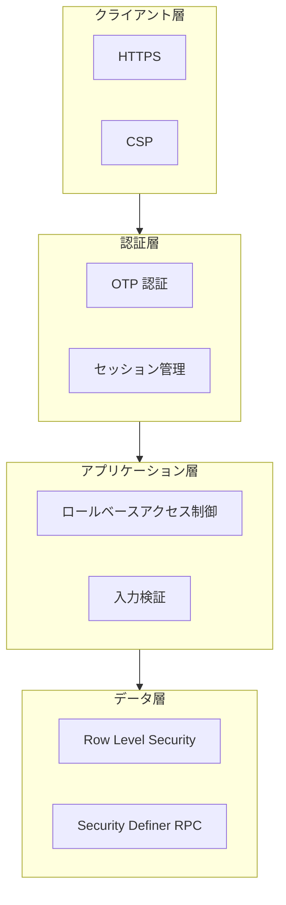

# セキュリティ概要

## 概要

notocord は、複数のセキュリティレイヤーでアプリケーションを保護しています。

## セキュリティアーキテクチャ



## 認証

### パスワードレス認証

- マジックリンク / OTP による認証
- パスワードなしでセキュアなアクセス

### セッション管理

- Supabase Auth によるセッション管理
- Cookie ベースのトークン保存
- 自動リフレッシュ

## 認可

### ロールベースアクセス制御 (RBAC)

| ロール | 説明 |
|--------|------|
| staff | シフト申請のみ |
| reviewer | 申請の承認・管理 |
| admin | 全機能アクセス |

### 権限チェックポイント

1. **UI レベル**: ナビゲーション表示制御
2. **API レベル**: エンドポイントの認可
3. **DB レベル**: RLS / RPC による制御

## データ保護

### Row Level Security (RLS)

- staff: 自分のデータのみアクセス
- reviewer/admin: 全データアクセス
- 書き込みは RPC 経由のみ

### 入力検証

- クライアント: React Hook Form + Zod
- サーバー: RPC 内でのバリデーション

### データ暗号化

- 転送時: HTTPS (TLS)
- 保存時: Supabase による暗号化

## セキュリティ機能一覧

| 機能 | 説明 | 実装 |
|------|------|------|
| HTTPS | 通信の暗号化 | Vercel / Supabase |
| OTP 認証 | パスワードレス認証 | Supabase Auth |
| セッション管理 | 安全なセッション | Supabase Auth |
| RBAC | ロールベース認可 | アプリ / RLS |
| RLS | 行レベルセキュリティ | PostgreSQL |
| 入力検証 | 入力のサニタイズ | Zod / RPC |
| CSRF 対策 | クロスサイトリクエスト | SameSite Cookie |

## セキュリティのベストプラクティス

### 1. 最小権限の原則

必要最小限の権限のみ付与。

### 2. 多層防御

複数のセキュリティレイヤーで保護。

### 3. 入力の検証

すべての入力をサーバーサイドで検証。

### 4. 機密情報の保護

- 環境変数で管理
- クライアントに公開しない

### 5. 監査ログ

すべての操作を履歴として記録。

## 環境変数のセキュリティ

### 公開可能

```env
NEXT_PUBLIC_SUPABASE_URL=...
NEXT_PUBLIC_SUPABASE_ANON_KEY=...
```

### 非公開（サーバーのみ）

```env
SUPABASE_SERVICE_ROLE_KEY=...
FIRST_ADMIN_EMAIL=...
```

## インシデント対応

### 1. 検知

- ログの監視
- 異常なアクセスパターン

### 2. 対応

- 影響を受けたアカウントの無効化
- セッションの無効化

### 3. 報告

- インシデントの記録
- 影響範囲の特定

### 4. 改善

- 原因分析
- 対策の実施

## 定期的なセキュリティ作業

| 作業 | 頻度 |
|------|------|
| 依存関係の更新 | 月次 |
| アクセス権限の棚卸し | 四半期 |
| セキュリティレビュー | 半期 |

## 関連ドキュメント

- [認証フロー](02-auth-flow.md)
- [権限管理](03-permissions.md)
- [RLS ポリシー](../06-database/02-rls.md)
