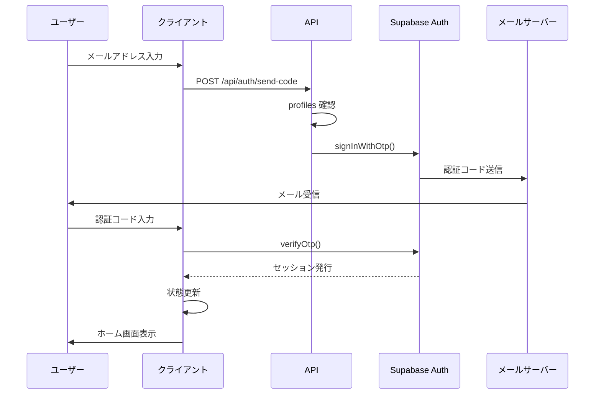
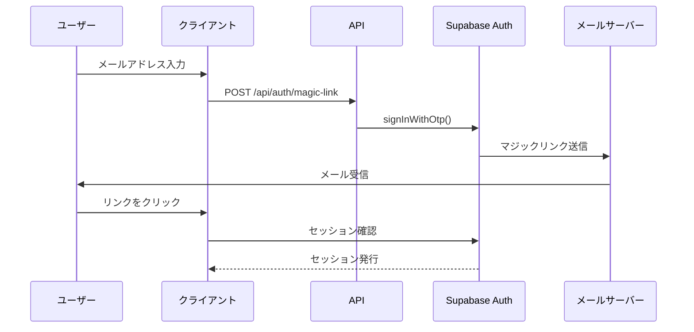

# 認証フロー

## 概要

notocord の認証フローは、Supabase Auth を使用したパスワードレス認証です。

## 認証方式

### OTP (One-Time Password)

メールで送信される6桁の認証コードを使用。



### マジックリンク

メールに含まれるリンクをクリックして認証。



## セッション管理

### セッションの保存

```typescript
// @supabase/ssr による Cookie 管理
import { createBrowserClient } from "@supabase/ssr";

const supabase = createBrowserClient(
  process.env.NEXT_PUBLIC_SUPABASE_URL!,
  process.env.NEXT_PUBLIC_SUPABASE_ANON_KEY!
);
```

### セッションの確認

```typescript
// クライアントサイド
const { data: { session } } = await supabase.auth.getSession();

// サーバーサイド
import { createClient } from "@/lib/supabase/server";
const supabase = await createClient();
const { data: { user } } = await supabase.auth.getUser();
```

### セッションのリフレッシュ

Supabase Auth が自動的にトークンをリフレッシュ。

## 認証状態の管理

### 初期化フロー

```typescript
init: async () => {
  if (get().initialized) return;
  set({ initialized: true, authLoading: true });

  // セッション確認
  const { data: sessionData } = await supabase.auth.getSession();
  const session = sessionData.session ?? null;
  set({ session });

  if (session) {
    await loadProfileAndData(set, get, session);
  }

  set({ authLoading: false });

  // 認証状態変更リスナー
  supabase.auth.onAuthStateChange(async (event, newSession) => {
    // 状態更新
  });
}
```

### 認証状態の変更

```typescript
supabase.auth.onAuthStateChange(async (event, newSession) => {
  set({ session: newSession ?? null, authLoading: true });
  
  if (newSession) {
    await loadProfileAndData(set, get, newSession);
  } else {
    set({
      currentUser: null,
      users: [],
      requests: [],
      // ...
    });
  }
  
  set({ authLoading: false });
});
```

## ログアウト

```typescript
logout: async () => {
  await supabase.auth.signOut();
  set({
    currentUser: null,
    session: null,
    users: [],
    requests: [],
    // ...
  });
}
```

## エラーハンドリング

### 認証エラーの種類

| エラー | 原因 | 対処 |
|--------|------|------|
| Invalid OTP | コード不正/期限切れ | 再送信 |
| User not found | 未登録メール | 管理者に連絡 |
| User banned | ユーザー無効 | 管理者に連絡 |
| Rate limit | リクエスト過多 | 待機 |

### エラー処理

```typescript
const { error } = await supabase.auth.verifyOtp({
  email,
  token: code,
  type: "email",
});

if (error) {
  switch (error.message) {
    case "Token has expired or is invalid":
      return { ok: false, error: "認証コードが無効です" };
    case "Email rate limit exceeded":
      return { ok: false, error: "しばらく待ってから再試行してください" };
    default:
      return { ok: false, error: "認証に失敗しました" };
  }
}
```

## セキュリティ考慮事項

### OTP の有効期限

- デフォルト: 60秒〜数分
- 設定変更可能（Supabase Dashboard）

### レート制限

- Supabase Auth の組み込み制限
- 過度なリクエストをブロック

### 未登録ユーザーの防止

```typescript
await supabase.auth.signInWithOtp({
  email,
  options: {
    shouldCreateUser: false, // 自動作成を無効
  },
});
```

### 無効ユーザーの排除

```typescript
// ログイン後のチェック
if (!profile.active) {
  await supabase.auth.signOut();
  set({ currentUser: null, session: null });
  return;
}
```

## 関連ドキュメント

- [セキュリティ概要](01-overview.md)
- [権限管理](03-permissions.md)
- [認証 API](../05-api/02-auth-api.md)
