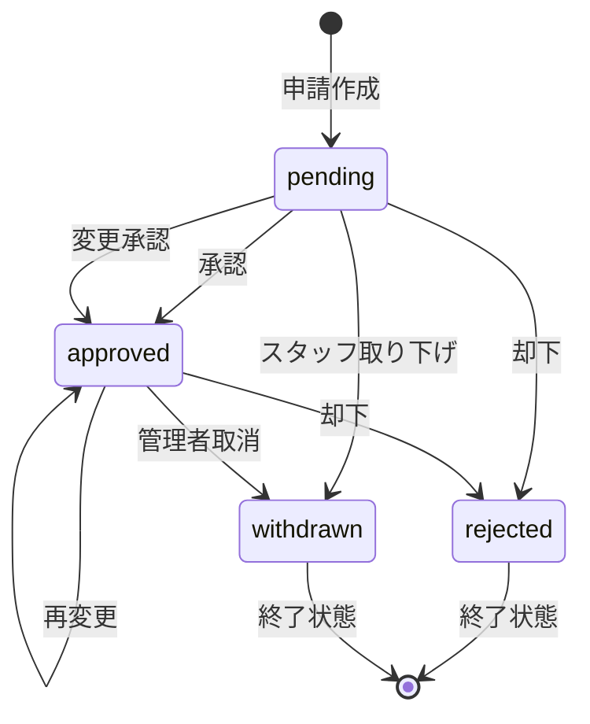

# ステータス遷移図

## 概要

notocord の申請ステータスの遷移について説明します。

## ステータス一覧

| ステータス | 英語 | 説明 |
|-----------|------|------|
| 保留中 | pending | 承認待ちの状態 |
| 確定 | approved | 承認された状態 |
| 却下 | rejected | 承認されなかった状態 |
| 取り下げ | withdrawn | 取り消された状態 |

## 遷移図



## 遷移条件

### pending → approved（承認）

**実行者**: reviewer, admin

**条件**:
- ステータスが pending
- バリデーションを満たす

**アクション**:
- `review_fix_request` または `review_flex_request` RPC

### pending → approved（変更承認）

**実行者**: reviewer, admin

**条件**:
- ステータスが pending
- バリデーションを満たす
- Fix の場合、変更理由必須

**アクション**:
- `review_fix_request` または `review_flex_request` RPC
- decision_type = 'modify'

### pending → rejected（却下）

**実行者**: reviewer, admin

**条件**:
- ステータスが pending

**アクション**:
- `review_fix_request` または `review_flex_request` RPC
- decision_type = 'reject'

### pending → withdrawn（取り下げ）

**実行者**: 申請者本人（staff）

**条件**:
- ステータスが pending
- 取り下げ理由を入力

**アクション**:
- `withdraw_request` RPC

### approved → approved（再承認/再変更）

**実行者**: reviewer, admin

**条件**:
- ステータスが approved
- バリデーションを満たす

**アクション**:
- `review_fix_request` または `review_flex_request` RPC

### approved → rejected（却下）

**実行者**: reviewer, admin

**条件**:
- ステータスが approved

**アクション**:
- `review_fix_request` または `review_flex_request` RPC
- decision_type = 'reject'

### approved → withdrawn（取消）

**実行者**: reviewer, admin

**条件**:
- ステータスが approved
- 取消理由を入力

**アクション**:
- `cancel_approved_request` RPC

## 終了状態

以下のステータスは終了状態です：

- **rejected**: 再申請は可能（新規申請として）
- **withdrawn**: 再申請は可能（新規申請として）

## 履歴への記録

すべてのステータス遷移は `shift_request_histories` テーブルに記録されます：

```json
{
  "action": "review",
  "from_status": "pending",
  "to_status": "approved",
  "from_decision_type": null,
  "to_decision_type": "approve",
  "actor_id": "reviewer-uuid",
  "created_at": "2026-03-01T10:00:00Z"
}
```

## 関連ドキュメント

- [シフト申請](../03-features/01-staff-requests.md)
- [シフト承認](../03-features/02-reviewer-approval.md)
- [変更履歴](../03-features/05-history.md)
