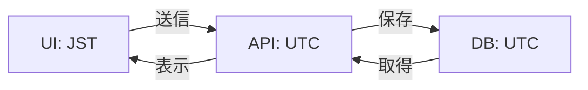

# 日時処理

## 概要

notocord での日時処理について説明します。

## タイムゾーン

### システムのタイムゾーン

- サーバー: UTC
- クライアント: ユーザーのローカルタイムゾーン（主に JST）
- データベース: UTC（timestamptz）

### 変換の流れ



## 日付ライブラリ

### date-fns

notocord では `date-fns` を使用しています。

```typescript
import { format, parseISO, startOfWeek, addDays } from "date-fns";
import { ja } from "date-fns/locale";

// フォーマット
format(new Date(), "yyyy/MM/dd", { locale: ja });
// → "2026/03/01"

// ISO文字列のパース
parseISO("2026-03-01T09:00:00+09:00");

// 週の開始日
startOfWeek(new Date(), { weekStartsOn: 1 }); // 月曜始まり
```

## ISO 週番号

### 定義

- 月曜日を週の始まりとする
- 1月4日を含む週を第1週とする

### 計算

```typescript
import { getISOWeek, getISOWeekYear, startOfISOWeek } from "date-fns";

const date = new Date("2026-03-01");

// ISO週番号
getISOWeek(date);      // 9

// ISO年
getISOWeekYear(date);  // 2026

// 週の開始日（月曜）
startOfISOWeek(date);  // 2026-02-23 (月曜)
```

### データベースでの計算

```sql
-- ISO週番号
SELECT to_char(date, 'IW') as iso_week;

-- ISO年
SELECT to_char(date, 'IYYY') as iso_year;

-- 週の開始日
SELECT date_trunc('week', date)::date as week_start_date;
```

## 時刻の処理

### 時刻文字列のパース

```typescript
// "HH:MM" 形式を分に変換
function parseTime(timeStr: string): number {
  const [hours, minutes] = timeStr.split(":").map(Number);
  return hours * 60 + minutes;
}

parseTime("09:00");  // 540
parseTime("17:30");  // 1050
```

### 時間の計算

```typescript
// 時間差の計算
function getDurationHours(start: string, end: string): number {
  const startMinutes = parseTime(start);
  const endMinutes = parseTime(end);
  return (endMinutes - startMinutes) / 60;
}

getDurationHours("09:00", "17:00");  // 8
```

## フォーマット

### 日付フォーマット

```typescript
// 標準的な表示
format(date, "yyyy/MM/dd");      // "2026/03/01"
format(date, "yyyy年M月d日");     // "2026年3月1日"
format(date, "M/d (E)", { locale: ja });  // "3/1 (日)"
```

### 時刻フォーマット

```typescript
format(date, "HH:mm");           // "09:00"
format(date, "H:mm");            // "9:00"
format(date, "HH:mm:ss");        // "09:00:00"
```

### 週表示

```typescript
// 週の表示
function formatWeek(date: Date): string {
  const year = getISOWeekYear(date);
  const week = getISOWeek(date);
  const start = startOfISOWeek(date);
  const end = addDays(start, 6);
  
  return `${year}年 第${week}週 (${format(start, "M/d")}〜${format(end, "M/d")})`;
}

formatWeek(new Date("2026-03-01"));
// → "2026年 第9週 (2/23〜3/1)"
```

## バリデーション

### 過去日チェック

```typescript
import { isBefore, startOfDay } from "date-fns";

function isPastDate(date: Date): boolean {
  const today = startOfDay(new Date());
  return isBefore(date, today);
}
```

### 3ヶ月先チェック

```typescript
import { addMonths, isAfter } from "date-fns";

function isTooFar(date: Date): boolean {
  const limit = addMonths(new Date(), 3);
  return isAfter(date, limit);
}
```

### 時間範囲チェック

```typescript
function isValidTimeRange(start: string, end: string): boolean {
  return parseTime(end) > parseTime(start);
}

function isWithin8Hours(start: string, end: string): boolean {
  return getDurationHours(start, end) <= 8;
}
```

## データベースでの処理

### JST 変換

```sql
-- UTC を JST に変換
SELECT created_at AT TIME ZONE 'Asia/Tokyo' as created_at_jst;

-- JST で今日の申請を取得
SELECT * FROM shift_requests
WHERE requested_start_at AT TIME ZONE 'Asia/Tokyo' >= CURRENT_DATE;
```

### 週の計算

```sql
-- 今週の開始日（月曜）
SELECT date_trunc('week', CURRENT_DATE)::date;

-- 今週の Flex 申請を取得
SELECT * FROM shift_requests
WHERE type = 'flex'
  AND week_start_date = date_trunc('week', CURRENT_DATE)::date;
```

## 関連ドキュメント

- [スキーマ設計](../06-database/01-schema.md)
- [RPC 関数](../05-api/03-rpc-functions.md)
- [シフト申請](../03-features/01-staff-requests.md)
