# 状態遷移の詳細

## 概要

申請のステータス遷移について詳細に説明します。

## Fix 申請の状態遷移

### 新規作成

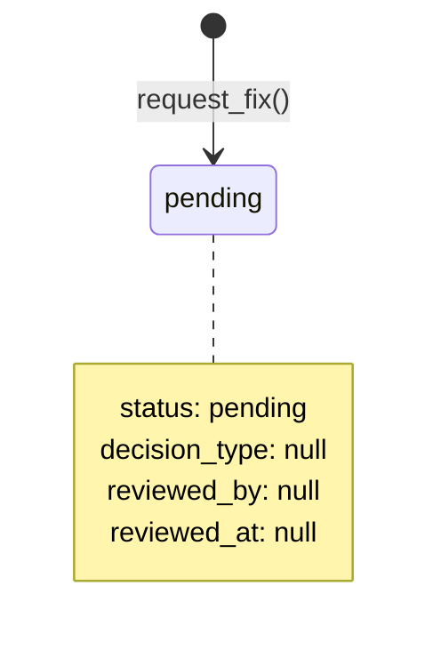

### 承認

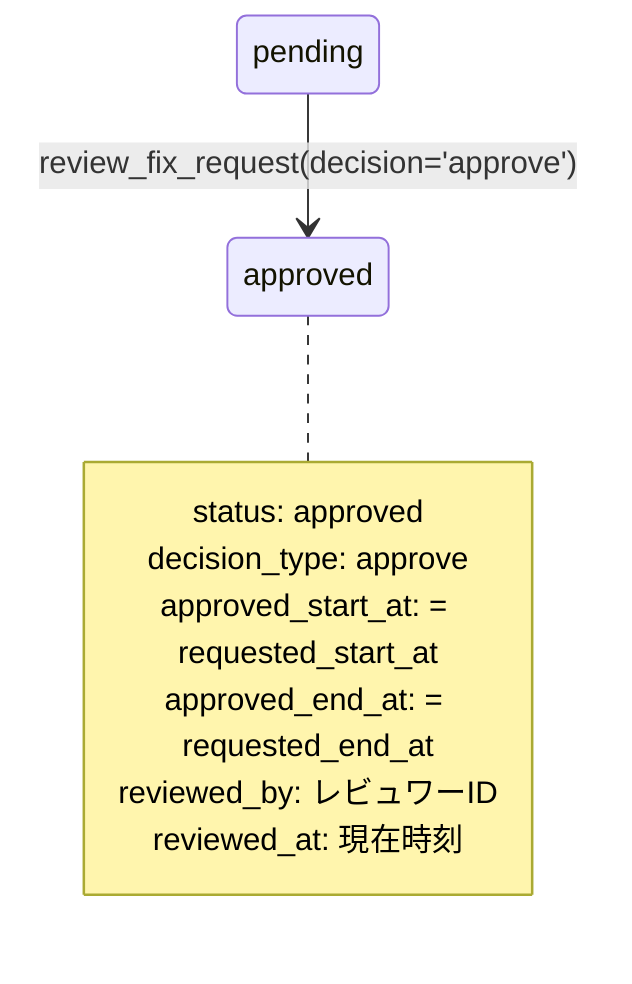

### 変更承認

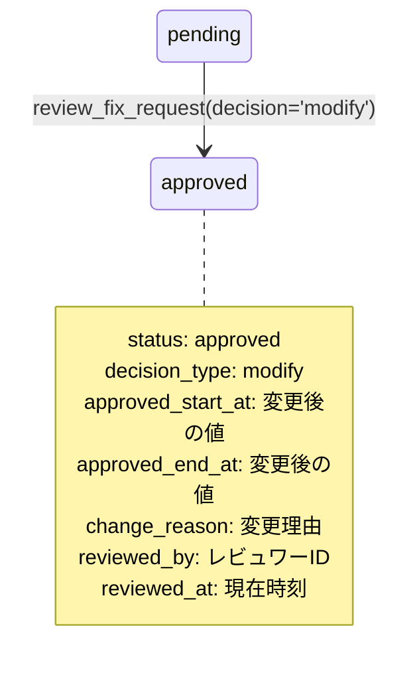

### 却下

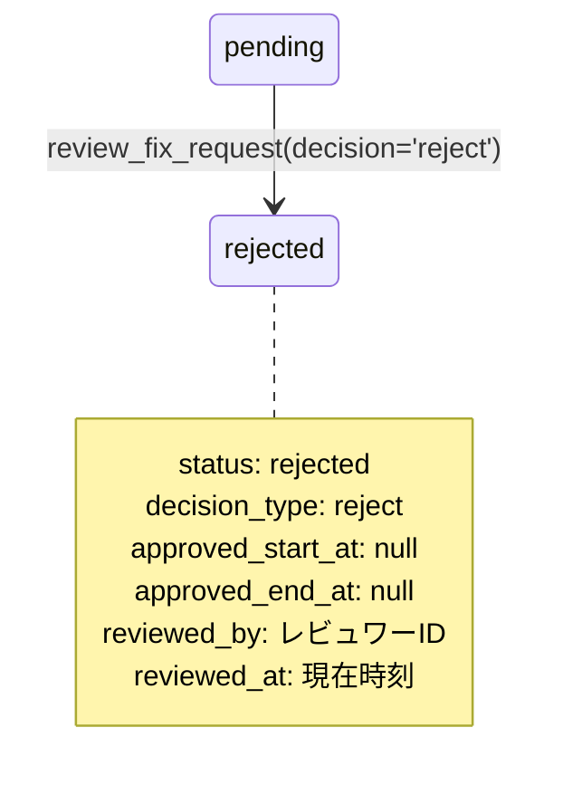

### 取り下げ

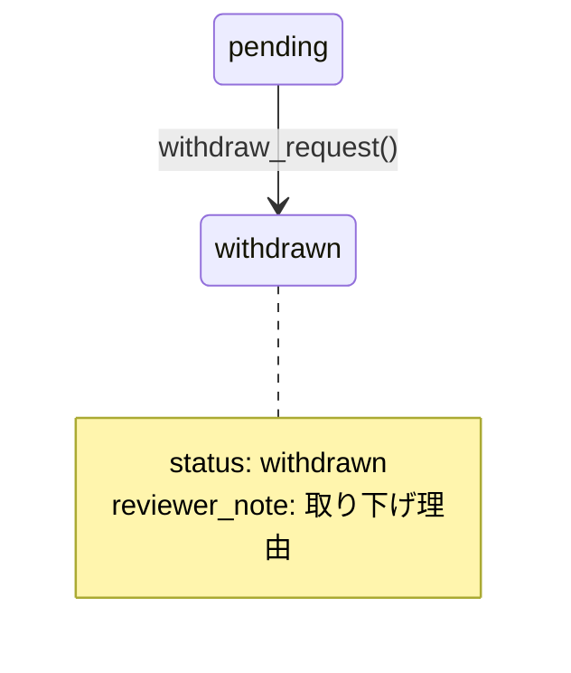

### 承認取消

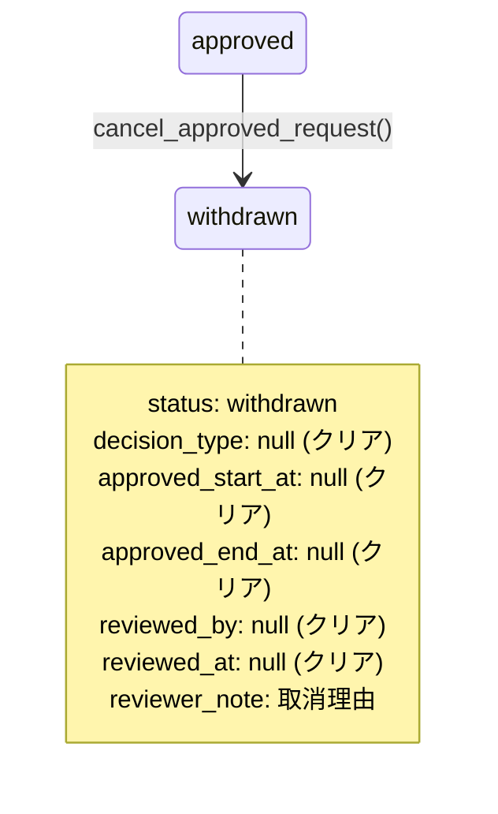

## Flex 申請の状態遷移

### 新規作成

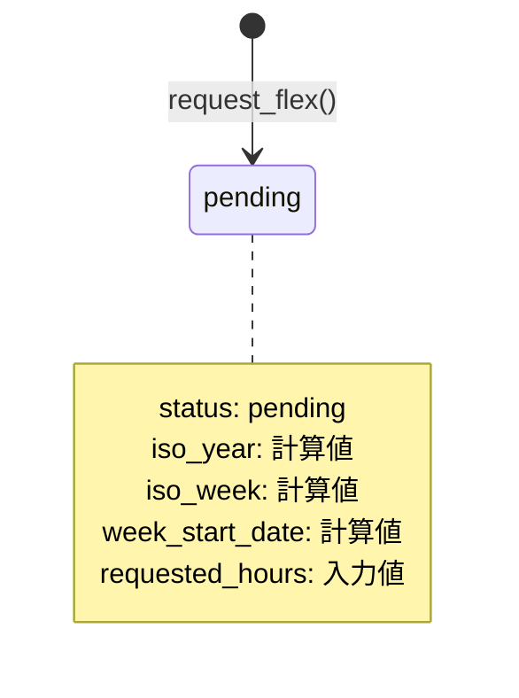

### 承認

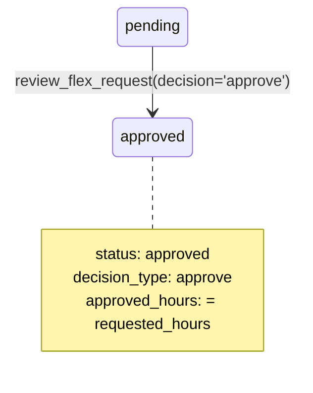

### 変更承認

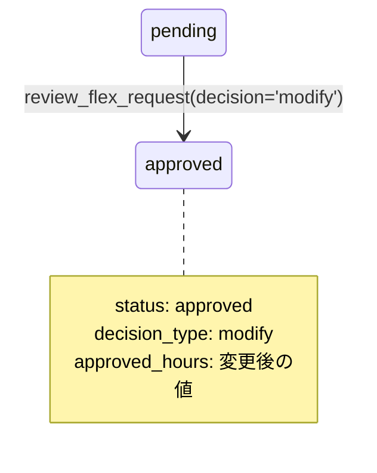

## 代理作成

### Fix 代理作成

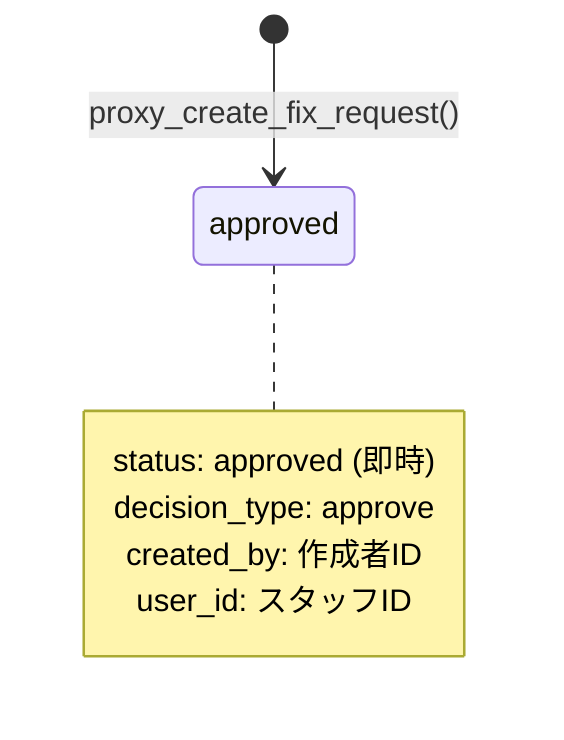

### Flex 代理作成

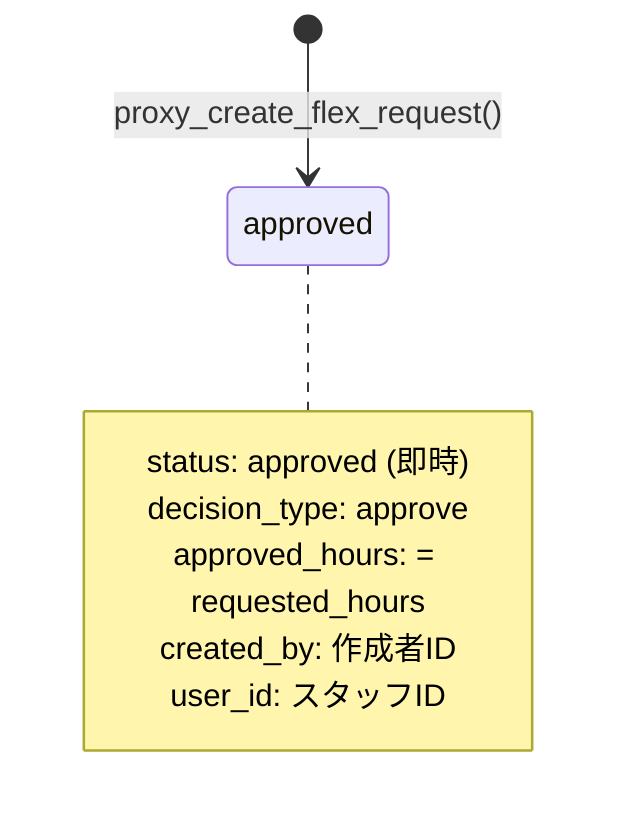

## 承認済み申請の再処理

### 再承認/再変更

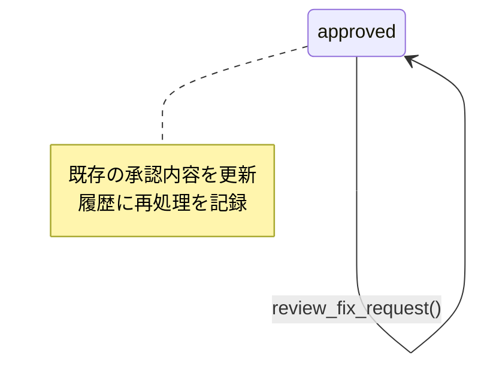

## データの変化

### pending → approved (approve)

| カラム | 変更前 | 変更後 |
|--------|--------|--------|
| status | pending | approved |
| decision_type | null | approve |
| approved_* | null | = requested_* |
| reviewed_by | null | レビュワーID |
| reviewed_at | null | 現在時刻 |
| reviewer_note | null | メッセージ |

### pending → approved (modify)

| カラム | 変更前 | 変更後 |
|--------|--------|--------|
| status | pending | approved |
| decision_type | null | modify |
| approved_* | null | 変更値 |
| change_reason | null | 変更理由 |
| reviewed_by | null | レビュワーID |
| reviewed_at | null | 現在時刻 |
| reviewer_note | null | メッセージ |

### pending → rejected

| カラム | 変更前 | 変更後 |
|--------|--------|--------|
| status | pending | rejected |
| decision_type | null | reject |
| approved_* | null | null |
| reviewed_by | null | レビュワーID |
| reviewed_at | null | 現在時刻 |
| reviewer_note | null | メッセージ |

### pending → withdrawn

| カラム | 変更前 | 変更後 |
|--------|--------|--------|
| status | pending | withdrawn |
| reviewer_note | null | 取り下げ理由 |

### approved → withdrawn

| カラム | 変更前 | 変更後 |
|--------|--------|--------|
| status | approved | withdrawn |
| decision_type | approve/modify | null |
| approved_* | 値 | null |
| reviewed_by | ID | null |
| reviewed_at | 時刻 | null |
| reviewer_note | 値 | 取消理由 |

## 関連ドキュメント

- [ステータス遷移図](02-status-transitions.md)
- [RPC 関数](../05-api/03-rpc-functions.md)
- [スキーマ設計](../06-database/01-schema.md)
